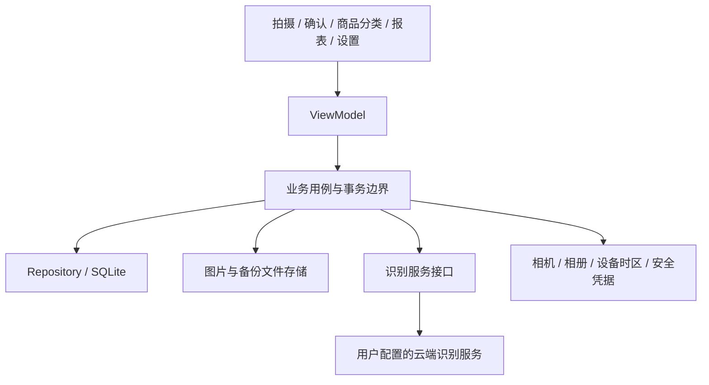
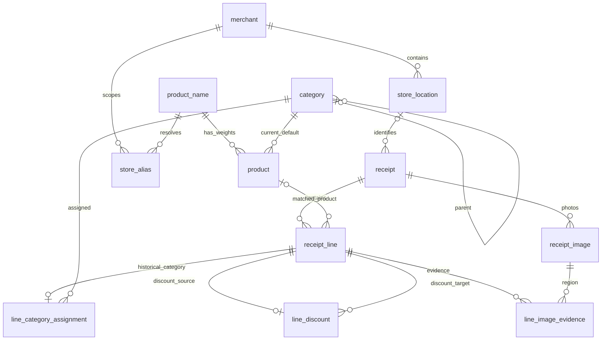

> 本文件保留第一版历史方案。当前名称、分类、数据库与 API 以 [第二版设计](backend_api_v2.md) 和 `src/backend_api/schema.sql` 为准：仅有票面名称与商品名称两层，不保留店内映射或标准名称层。

> 当前采用 Unlimited-OCR + PP-OCRv6 medium，backend_api 负责通用和按店铺解析；下文保留历史计划。现行设计见 [backend_ocr.md](backend_ocr.md)。

# Receipt Master 第一版技术方案与数据库设计

- 日期：2026-09-15
- 状态：需求已通过访谈确认；本文为实施设计，尚未实现应用。
- 目标：Android / iOS 拍摄 grocery 收据，云端识别、人工确认、本地保存，按商品和分类分析消费。
- 项目现状：仅有 LICENSE，无既有应用框架和数据库需要兼容。

## 1. 已确认的产品边界

### 1.1 第一版范围

1. 先个人使用，未来再向其他用户提供。首先验收美国、USD、英文 grocery 收据；保留国家和币种，允许其他国家收据手工修正，不承诺其他语言的自动识别质量。
2. Flutter Android / iOS 应用，SQLite 本地存储。第一版无账号、远端数据 API、自动云同步或多设备合并。
3. 云端识别允许上传照片；用户自行配置服务凭据。没有商品金额业务上限，也不因识别费用预算停止识别。服务商自身配额、网络故障和技术容量仍可能使请求失败，不能承诺无限可用。
4. 现场分段拍摄、相册多图导入、完全手工录入。第一版不做连续全景扫描、PDF 导入。
5. 确认页允许编辑和补录；不确定内容黄底并说明原因；不要求每行打勾，整张收据必须确认。
6. 日、周、月、季、年按当前设备时区统计；周一开始，自然月、自然季、自然年。币种分开，不换汇。
7. 关注分类、商品种类、具体商品的支出，不做平均每单金额等收据级分析；店铺用于追溯、筛选和别名范围。
8. 完整备份与整体恢复兼容两平台，另支持 CSV 导出。恢复不合并两台设备的数据。

### 1.2 关键业务定义

| 概念 | 定义 |
| --- | --- |
| 收据 | 一次购物或退款的原始凭据，随机 receipt_id，可由多张照片组成 |
| 明细 | 商品、商品优惠、整单优惠、税、小费、押金或其他明确调整 |
| 商品名称 | 用户确认的标准名称，包含需要区分的品牌、口味，不使用原始缩写作为身份 |
| 具体商品 | 标准名称 + 单件克数；克数可空；不同克数是不同 item |
| 购买数量 | 与规格分开；两袋 500g 大米是 500g 商品、数量 2，不是 1000g 商品 |
| 散装商品 | 本次 423g 与下次 510g 是不同具体商品，归入同一商品种类 |
| 分类树 | 分类和商品种类共用一棵树，无两层限制；任意节点可汇总后代 |
| 未分类 | 预置受保护节点，和其他分类走同一查询逻辑，不用 NULL 表示未分类 |
| 商品名称 | 连锁店范围内的票面名称到标准名称的映射；重量选择另外处理 |
| 待核对差额 | 收据总额减去全部已录入明细金额，动态计算，不伪装成小费或商品 |

第一版保存数量，但仅在单位相同时汇总；不进行跨单位价格比较。具体商品的克数必须可在确认页填写，历史规格用于建议而非静默覆盖。

## 2. 技术架构与选型

### 2.1 推荐技术栈

| 层 | 方案 | 原因与边界 |
| --- | --- | --- |
| 跨平台客户端 | Flutter + Dart | 同一业务代码覆盖 Android / iOS；摄像头、相册、安全存储由平台适配层调用 |
| 状态与展示 | View / ViewModel，按功能模块组织 | 展示不直接读数据库，不在控件中实现记账规则 |
| 数据库 | SQLite + Dart sqlite3 驱动，集中管理原生 SQL | 事务、外键、递归分类查询；不引入 ORM，便于核验 3NF |
| 数据访问 | Repository + 单写入队列 | 本地数据库是事实来源；耗时数据库工作在后台 isolate 执行 |
| 识别 | ReceiptRecognitionProvider 接口 + 一个首发云端适配器 | 使用支持图片输入及结构化结果的服务；不把厂商字段传入业务层 |
| 金额 / 数量 | 整数定点 + 十进制定点计算 | 金额不得用二进制浮点参与计算 |
| 时间 | UTC instant + 设备 IANA 时区适配器 | 本地日历边界在时区库中计算，然后变成 UTC 查询区间 |
| 图片 | 私有文件目录 + 数据库相对路径 | 图片不作为数据库大 BLOB；备份可跨设备移动 |
| 凭据 | iOS Keychain / Android 平台安全存储适配器 | 不写入数据库、日志、CSV、备份 |

Flutter 支持跨平台代码复用；本方案采用其展示、业务与数据访问分离思路，具体分层是本项目的工程选择。[Flutter 架构](https://docs.flutter.dev/resources/architectural-overview)、[架构建议](https://docs.flutter.dev/app-architecture/recommendations)。

Dart sqlite3 提供 SQLite 访问及移动平台支持；实施时锁定已验证依赖版本，在 Android 和 iOS 真机验证加载、事务及备份能力。[sqlite3 官方 API](https://pub.dev/documentation/sqlite3/latest/)。

首发识别厂商和具体模型在开发第一阶段用真实收据评测选定，不在本文承诺未经测试的准确率、价格或延迟。Flutter 版本、相机和时区插件同样在工程初始化时锁定；这不改变已确认需求。

### 2.2 模块关系



工程目录（按平台分离，共享实现只保留一份）：

```text
src/shared/
  lib/app/
  lib/features/{capture,review,catalog,reports,backup,settings}/
  lib/domain/
  lib/data/{repositories,database,recognition,files}/
  lib/platform/
  resources/database/schema.sql
  pubspec.yaml
src/android/
src/ios/
src/linux/                       # 已有 Linux 开发宿主
src/backend_api/                # Rust/Axum API + 本地 Qwen 结构化模型
src/backend_ocr/                # 独立 Unlimited-OCR REST 服务
tests/shared/{domain,database,recognition,backup,integration}/
docs/1st_plan.md
build/mobile/
build/flutter/                    # 工具要求的临时工程布局
```

当前 schema 集中在 schema.sql，升级 SQL 逐版本追加；不得通过删库重建升级用户数据。测试目录通过显式测试命令运行；平台工程需要的工具入口遵循 Flutter 实际约定。

## 3. 核心流程

### 3.1 分段拍摄与识别

1. 创建随机 UUID v4 收据，状态 draft；照片写入临时文件、校验后原子改名，再记录数据库引用。
2. 每拍一段立即保存，提供上一段尾部参考；建议约 20%–30% 重叠，这是拍摄引导而非拒绝条件。
3. 用户可旋转、重排、补拍、删除段落；保存压缩后的原始各段，衍生裁切图不覆盖原图。
4. 检查模糊、反光、缺边，建议重拍。分段合并目标是完整且不重复的结构化结果，不要求先生成一张超长拼接图。
5. 适配器按服务图片容量分批识别；识别行携带来源图片、框位置、原始文字和顺序。
6. 使用相邻图片尾部/头部的多行上下文、坐标顺序、名称和金额进行序列对齐。不能仅按名称和金额去重，同一商品可能真实出现两行。
7. 无法确定的重叠行保留并标黄，允许用户合并或删除；缺失部分标出，不凭空补商品。
8. 校验结构、金额、时间、分类匹配后进入确认页。云端结果只产生候选数据，不能直接修改已确认记录或执行任意操作。

云端返回 schema 应包含原始店名/分店/地址、票面时间文字、币种、收据总额、明细、重量、单位、候选置信度和图像证据。缺失字段为 null，不用 0 或空字符串假装识别成功。SKU、原文、数量、单价和明细金额分别处理。

### 3.2 草稿、正式保存与重试

- draft：可以不完整，不进入报表。识别任务状态单独保存，不用收据状态代替任务状态。
- posted：用户已执行整单确认，进入报表；核对结果由当前字段和差额动态计算。
- deleted_at_utc_ms 非空：回收站，不进入报表；恢复保留原发布状态。
- 正式保存至少要求币种、UTC 消费时间、总额、所有现有明细金额与有效统计分类。商品匹配和克数可以未确定。
- 用户无票面总额时可以明确采用明细合计，记录总额来源为用户推算；之后编辑明细不自动改掉总额。
- 金额有差额仍可正式保存为待核对；估计时间等问题可由用户确认接受，但估计标记永久保留直到纠正。
- 编辑正式收据在工作副本进行，提交前报表仍使用旧的正式数据；提交后事务更新并重新核对，取消编辑不污染正式记录。
- 识别任务使用输入修订号。请求期间用户修改图片或内容后，旧结果不得覆盖新版本；重试不会自动追加重复明细。
- 网络失败保留草稿。对状态不明的付费调用不做无限自动重试，展示重试入口和可能重复计费；不是预算限制。

### 3.3 黄色提示

字段置信度低于配置阈值、缺失字段、推测重量、估计时间、重复候选、金额不一致、数量单价关系异常均可产生提示。提供文字及图标，不能仅靠颜色表达。

模型自报分数不是可靠概率；阈值是工程启发式，使用真实样本调校。没有置信度时不能伪造高分。用户修改对应字段后重新计算提示，不能仅把旧提示永久隐藏。

### 3.4 时间处理

- 业务模型的所有确定时刻和数据库时间列：Unix epoch 毫秒 INTEGER，UTC；接口用带 Z 的 UTC ISO 8601。
- 票面字符串作为识别证据保留，不作为第二套可查询的本地时间字段。
- 默认用设备 IANA 时区解释票面时间；确认页允许更改这次解释使用的消费时区。GPS 不是必需权限，也不能证明消费位置。
- 有日期无钟点：保留票面日期，采用所选消费时区下录入时刻的钟点补齐，记录 estimated_clock。
- 全部缺失：直接使用录入时刻对应的 UTC instant，记录 estimated_instant。
- 夏令时重复时刻存在两个 UTC 候选时让用户选择；不存在的当地时刻标黄要求修正，不静默偏移一小时。
- 转换完成后仅持久化 UTC、时间来源标记和原始票面文字；不另存可查询的当地日期、小时或消费时区列。
- 显示和查询使用当前设备时区，设备时区变化时使报表缓存失效。计算下一当地日期边界，不能用 UTC 起点加固定 24 小时替代。

## 4. 3NF 模型与历史语义

### 4.1 设计原则

每表只描述一种事实，非键字段依赖该表的候选键，不借助另一个非键字段表达相同事实。UUID 并不自动保证 3NF；下面明确自然键和关联路径。

| 表 | 候选键 / 主键 | 事实与 3NF 说明 |
| --- | --- | --- |
| currency | code | 币种决定小数位，不在每张收据重复保存 |
| merchant | merchant_id | 标准连锁店；同名商家不自动合并 |
| store_location | location_id | 分店及其连锁店关系；收据不重复存 merchant_id |
| category | category_id；非空 system_key | 分类名称和父节点，不存祖先列表或路径字符串 |
| product_name | name_id；standard_name | 含品牌口味的原子标准名称，不另存由名称解析出的重复品牌字段 |
| product | product_id；name_id + weight_mg（空规格单独唯一） | 规格身份与当前默认分类；不重复商品名称 |
| store_alias | alias_id；merchant_id + alias_text | 店内别名映射到标准名称；多个重量候选从商品表查询 |
| receipt | receipt_id | 当次票面事实、总额、状态；原始文字不等同标准商家资料 |
| receipt_line | line_id；receipt_id + position | 当次购买金额、产品匹配；不重复产品规格或收据币种 |
| line_category_assignment | line_id | 当次确认的统计归属，不是 product 当前默认类别的缓存 |
| line_discount | discount_line_id | 哪一条优惠属于哪一条商品；不重复收据 ID 或商品 ID |
| receipt_image | image_id；receipt_id + position | 收据照片及排序 |
| line_image_evidence | evidence_id | 一行对应一个图片区域，可一行多图或一图多行 |
| recognition_run | run_id | 一次实际云端请求及其结果，不存凭据 |
| review_issue | issue_id | 某字段/行的问题及处理状态；跨行一致性由事务校验 |
| recognition_budget | budget_id | 识别费用提醒设置，与消费金额上限无关 |

原始 store/address/item 文本描述“当时票面印了什么”，标准资料描述“用户认定它是谁”，二者不是同一个函数依赖。商品当前默认分类和历史明细已确认分类也是不同事实。

商品优惠的有效分类从目标商品明细继承，不再保存一个可失配的分类副本。派生的差额、有效分类、树汇总和核对结果使用查询/视图，不重复持久化。

### 4.2 关系图



分店未确定但连锁店确定时，可建立 branch_name/address 为空的未定位 store_location，挂到已确认连锁店。店铺完全未知则 receipt.location_id 留空，原始文字仍保留。确认新分店后创建或匹配分店并改变当前收据关联，不把公用的未定位记录改成真实分店以免影响其他收据。

### 4.3 精度、标识与约束

- 所有业务 ID 用 UUID v4 TEXT，离线生成，未来 API 可沿用；预置类别使用稳定的 UUID 常量。
- 金额 amount_minor 用币种最小单位的有符号 64 位整数，例如 USD 1234 表示 $12.34。
- 单价 unit_price_scaled 用“该币种最小单位的百万分之一”存整数，允许称重单价有额外精度；单价和实际行金额都是票面事实，不能互相强制推导覆盖。
- 数量 quantity_micros 用百万分之一单位存整数，可空；quantity_unit 描述 ea/g/kg/lb/ml/l 等。缺失数量保持空。
- 单件克数 UI 使用克，数据库 weight_mg 用整数毫克，最多三位小数克；大于 0 或 NULL。无产品金额上限不等于机器数值无限，超出整数范围必须报可修正错误，禁止截断。
- 名称、别名在写入前统一 Unicode NFC、首尾空白和连续空白，保留品牌、口味和标点；唯一性基于最终存储值。模糊匹配只作建议。
- 重量未知是有效规格状态；同名 NULL 规格只允许一个，不能使用 UNIQUE(name_id, weight_mg) 后就假定 NULL 唯一。

SQLite 每个连接必须启用外键；普通唯一性与条件唯一索引的行为需要显式处理。[外键文档](https://www.sqlite.org/foreignkeys.html)、[部分索引](https://www.sqlite.org/partialindex.html)。

## 5. SQLite 建表草案

以下为可在空库执行的核心 schema。跨表业务不变量在下一节定义，不宣称仅靠这些 DDL 已实现全部产品规则。实施时移到 canonical schema.sql，并生成首版迁移。

```sql
PRAGMA foreign_keys = ON;

CREATE TABLE currency (
    code TEXT PRIMARY KEY,
    minor_digits INTEGER NOT NULL CHECK (minor_digits BETWEEN 0 AND 6)
);

CREATE TABLE merchant (
    merchant_id TEXT PRIMARY KEY,
    name TEXT NOT NULL CHECK (length(trim(name)) > 0)
);

CREATE TABLE store_location (
    location_id TEXT PRIMARY KEY,
    merchant_id TEXT NOT NULL REFERENCES merchant(merchant_id),
    branch_name TEXT,
    address TEXT,
    country_code TEXT CHECK (country_code IS NULL OR length(country_code) = 2)
);

CREATE TABLE category (
    category_id TEXT PRIMARY KEY,
    parent_id TEXT REFERENCES category(category_id),
    name TEXT NOT NULL CHECK (length(trim(name)) > 0),
    system_key TEXT UNIQUE CHECK (
        system_key IS NULL OR system_key IN (
            'uncategorized', 'tax', 'tip', 'deposit', 'order_discount'
        )
    ),
    CHECK (parent_id IS NULL OR parent_id <> category_id)
);

CREATE TABLE product_name (
    name_id TEXT PRIMARY KEY,
    standard_name TEXT NOT NULL UNIQUE CHECK (length(trim(standard_name)) > 0)
);

CREATE TABLE product (
    product_id TEXT PRIMARY KEY,
    name_id TEXT NOT NULL REFERENCES product_name(name_id),
    weight_mg INTEGER CHECK (weight_mg IS NULL OR weight_mg > 0),
    default_category_id TEXT NOT NULL REFERENCES category(category_id)
);
CREATE UNIQUE INDEX product_known_weight_uq
    ON product(name_id, weight_mg) WHERE weight_mg IS NOT NULL;
CREATE UNIQUE INDEX product_unknown_weight_uq
    ON product(name_id) WHERE weight_mg IS NULL;

CREATE TABLE store_alias (
    alias_id TEXT PRIMARY KEY,
    merchant_id TEXT NOT NULL REFERENCES merchant(merchant_id),
    alias_text TEXT NOT NULL CHECK (length(trim(alias_text)) > 0),
    name_id TEXT NOT NULL REFERENCES product_name(name_id),
    UNIQUE (merchant_id, alias_text)
);

CREATE TABLE receipt (
    receipt_id TEXT PRIMARY KEY,
    location_id TEXT REFERENCES store_location(location_id),
    currency_code TEXT REFERENCES currency(code),
    country_code TEXT CHECK (country_code IS NULL OR length(country_code) = 2),
    raw_store TEXT,
    raw_branch TEXT,
    raw_address TEXT,
    raw_time_text TEXT,
    occurred_at_utc_ms INTEGER,
    time_source TEXT NOT NULL DEFAULT 'unresolved' CHECK (
        time_source IN ('unresolved', 'recognized', 'user_entered',
                        'estimated_clock', 'estimated_instant')
    ),
    total_minor INTEGER,
    total_source TEXT CHECK (
        total_source IN ('recognized', 'user_entered', 'user_computed')
    ),
    status TEXT NOT NULL DEFAULT 'draft' CHECK (status IN ('draft', 'posted')),
    input_revision INTEGER NOT NULL DEFAULT 0 CHECK (input_revision >= 0),
    created_at_utc_ms INTEGER NOT NULL,
    updated_at_utc_ms INTEGER NOT NULL,
    deleted_at_utc_ms INTEGER,
    CHECK (status = 'draft' OR (
        currency_code IS NOT NULL AND occurred_at_utc_ms IS NOT NULL
        AND total_minor IS NOT NULL AND total_source IS NOT NULL
        AND time_source <> 'unresolved'
    ))
);

CREATE TABLE receipt_line (
    line_id TEXT PRIMARY KEY,
    receipt_id TEXT NOT NULL REFERENCES receipt(receipt_id) ON DELETE CASCADE,
    position INTEGER NOT NULL CHECK (position >= 0),
    kind TEXT NOT NULL CHECK (
        kind IN ('product', 'item_discount', 'order_discount',
                 'tax', 'tip', 'deposit', 'other_adjustment')
    ),
    raw_name TEXT,
    product_id TEXT REFERENCES product(product_id),
    quantity_micros INTEGER CHECK (quantity_micros IS NULL OR quantity_micros > 0),
    quantity_unit TEXT,
    unit_price_scaled INTEGER,
    amount_minor INTEGER,
    CHECK ((quantity_micros IS NULL) = (quantity_unit IS NULL)),
    CHECK (product_id IS NULL OR kind = 'product'),
    CHECK (kind NOT IN ('item_discount', 'order_discount')
           OR amount_minor IS NULL OR amount_minor <= 0),
    CHECK (kind NOT IN ('item_discount', 'order_discount')
           OR unit_price_scaled IS NULL OR unit_price_scaled <= 0),
    UNIQUE (receipt_id, position)
);

CREATE TABLE line_category_assignment (
    line_id TEXT PRIMARY KEY REFERENCES receipt_line(line_id) ON DELETE CASCADE,
    category_id TEXT NOT NULL REFERENCES category(category_id)
);

CREATE TABLE line_discount (
    discount_line_id TEXT PRIMARY KEY REFERENCES receipt_line(line_id) ON DELETE CASCADE,
    target_line_id TEXT NOT NULL REFERENCES receipt_line(line_id),
    CHECK (discount_line_id <> target_line_id)
);

CREATE TABLE receipt_image (
    image_id TEXT PRIMARY KEY,
    receipt_id TEXT NOT NULL REFERENCES receipt(receipt_id) ON DELETE CASCADE,
    position INTEGER NOT NULL CHECK (position >= 0),
    relative_path TEXT NOT NULL UNIQUE,
    content_sha256 TEXT NOT NULL,
    width_px INTEGER NOT NULL CHECK (width_px > 0),
    height_px INTEGER NOT NULL CHECK (height_px > 0),
    captured_at_utc_ms INTEGER,
    imported_at_utc_ms INTEGER NOT NULL,
    UNIQUE (receipt_id, position)
);

CREATE TABLE line_image_evidence (
    evidence_id TEXT PRIMARY KEY,
    line_id TEXT NOT NULL REFERENCES receipt_line(line_id) ON DELETE CASCADE,
    image_id TEXT NOT NULL REFERENCES receipt_image(image_id) ON DELETE CASCADE,
    x0 REAL NOT NULL CHECK (x0 BETWEEN 0 AND 1),
    y0 REAL NOT NULL CHECK (y0 BETWEEN 0 AND 1),
    x1 REAL NOT NULL CHECK (x1 BETWEEN 0 AND 1),
    y1 REAL NOT NULL CHECK (y1 BETWEEN 0 AND 1),
    CHECK (x1 > x0 AND y1 > y0)
);

CREATE TABLE recognition_run (
    run_id TEXT PRIMARY KEY,
    receipt_id TEXT NOT NULL REFERENCES receipt(receipt_id) ON DELETE CASCADE,
    input_revision INTEGER NOT NULL,
    provider TEXT NOT NULL,
    model TEXT NOT NULL,
    provider_request_id TEXT,
    status TEXT NOT NULL CHECK (
        status IN ('queued', 'running', 'succeeded', 'failed', 'unknown', 'cancelled')
    ),
    started_at_utc_ms INTEGER NOT NULL,
    finished_at_utc_ms INTEGER,
    result_relative_path TEXT,
    error_code TEXT,
    estimated_cost_minor INTEGER CHECK (estimated_cost_minor IS NULL OR estimated_cost_minor >= 0),
    cost_currency_code TEXT REFERENCES currency(code),
    CHECK ((estimated_cost_minor IS NULL) = (cost_currency_code IS NULL))
);

CREATE TABLE review_issue (
    issue_id TEXT PRIMARY KEY,
    receipt_id TEXT NOT NULL REFERENCES receipt(receipt_id) ON DELETE CASCADE,
    line_id TEXT REFERENCES receipt_line(line_id) ON DELETE CASCADE,
    field_key TEXT NOT NULL,
    reason_code TEXT NOT NULL,
    confidence REAL CHECK (confidence IS NULL OR confidence BETWEEN 0 AND 1),
    state TEXT NOT NULL CHECK (state IN ('open', 'accepted', 'resolved')),
    created_at_utc_ms INTEGER NOT NULL,
    resolved_at_utc_ms INTEGER
);

CREATE TABLE recognition_budget (
    budget_id TEXT PRIMARY KEY,
    currency_code TEXT NOT NULL REFERENCES currency(code),
    monthly_amount_minor INTEGER NOT NULL CHECK (monthly_amount_minor > 0),
    reminder_percent INTEGER NOT NULL CHECK (reminder_percent BETWEEN 1 AND 100),
    enabled INTEGER NOT NULL CHECK (enabled IN (0, 1))
);

CREATE INDEX store_location_merchant_idx ON store_location(merchant_id);
CREATE INDEX category_parent_idx ON category(parent_id);
CREATE INDEX product_category_idx ON product(default_category_id);
CREATE INDEX alias_name_idx ON store_alias(name_id);
CREATE INDEX receipt_location_idx ON receipt(location_id);
CREATE INDEX receipt_report_idx ON receipt(currency_code, occurred_at_utc_ms)
    WHERE status = 'posted' AND deleted_at_utc_ms IS NULL;
CREATE INDEX line_product_idx ON receipt_line(product_id);
CREATE INDEX assignment_category_idx ON line_category_assignment(category_id);
CREATE INDEX discount_target_idx ON line_discount(target_line_id);
CREATE INDEX image_hash_idx ON receipt_image(content_sha256);
CREATE INDEX evidence_line_idx ON line_image_evidence(line_id);
CREATE INDEX evidence_image_idx ON line_image_evidence(image_id);
CREATE INDEX recognition_receipt_idx ON recognition_run(receipt_id);
CREATE INDEX review_receipt_idx ON review_issue(receipt_id, state);
CREATE INDEX review_line_idx ON review_issue(line_id);

CREATE VIEW line_effective_category AS
SELECT a.line_id
     , a.category_id
  FROM line_category_assignment AS a
UNION ALL
SELECT d.discount_line_id AS line_id
     , a.category_id
  FROM line_discount AS d
  JOIN line_category_assignment AS a ON a.line_id = d.target_line_id;

CREATE VIEW receipt_reconciliation AS
SELECT r.receipt_id
     , r.total_minor
     , COALESCE(SUM(l.amount_minor), 0) AS known_lines_minor
     , SUM(CASE WHEN l.line_id IS NOT NULL AND l.amount_minor IS NULL
                THEN 1 ELSE 0 END) AS missing_amount_count
     , r.total_minor - COALESCE(SUM(l.amount_minor), 0) AS difference_minor
  FROM receipt AS r
  LEFT JOIN receipt_line AS l ON l.receipt_id = r.receipt_id
 GROUP BY r.receipt_id;
```

### 5.1 必须实现的跨表不变量

以下在集中写入用例的同一事务内校验，并以数据库集成测试覆盖；关键关系实施时补触发器保护，导入外部备份同样检查，不允许 UI 绕过：

1. posted 的明细金额全部非空；每行恰好一个有效统计分类。
2. item_discount 必须有且仅有 line_discount 关系，不得另有 line_category_assignment；其他类型必须有且仅有直接分类，不得出现在 line_discount.discount_line_id。
3. 优惠和目标必须属于同一收据，目标类型为 product；删除目标前先删除、重绑或明确转为整单优惠，不能留下悬空关系。
4. 优惠数量统一为 1 ea，单价为相应负数金额的定点值；商品数量未知保持空。退款商品金额为负，数量用正数表示退回多少，通过金额符号区分方向。
5. 图片证据和问题所关联的明细必须属于同一收据。
6. 分类不能形成任何长度的环。system_key 不可修改；uncategorized 不可删除。其他预置节点也保留身份，只允许改名或移动。
7. 删除类别前显式迁移子节点、product 默认分类与历史 line_category_assignment，整个操作原子完成。
8. 给已有 NULL 重量记录补规格时，创建/查找新 product 并只改当前明细 product_id；绝不能 UPDATE 公用 NULL 商品的 weight_mg。
9. product 身份字段视为不可原地改写；规格或名称身份改变采用匹配新商品。名称显示修正可统一改名，但若与已有名称冲突必须显式合并并处理规格碰撞，不能自动丢记录。
10. 商品当前默认分类改变不更新历史 assignment；明确批量操作才修改指定历史行。商品优惠通过目标关联自动跟随该条历史归属。
11. 收据实际国家是当次确认的事实，store_location.country_code 是当前标准资料；修改标准分店资料不重写收据事实。
12. 本地费用预算按当前设备时区的自然月计算，同币种汇总；未知请求费用单独提示，不能当作零，也不能阻止识别。

### 5.2 初始化与事务

首次初始化插入 USD（minor_digits=2）以及稳定 UUID 的未分类、税费、小费、押金、整单优惠节点。旅行币种通过维护的币种字典增加，不允许把所有币种默认当两位小数。

数据库初始化启用 foreign_keys、WAL 和合理 busy_timeout；使用 PRAGMA user_version 标记当前结构，仅初始化空库并检查当前版本，不包含旧库迁移代码。所有连接外键开启；验证时运行 foreign_key_check。

正式保存事务：校验输入 → 匹配标准名称与规格 → 按用户选项更新别名 → 写收据和明细 → 写分类及优惠关联 → 更新证据与问题 → 重新核对 → 设置 posted → 提交。任一步失败整体回滚。

## 6. 统计算法与示例

### 6.1 金额口径

- 已录入明细合计 L = 所有正式、未删除收据明细的 amount_minor 合计。
- 净支出 N = 同一筛选范围内收据 total_minor 合计。
- 待核对差额 D = N − L；分类汇总合计 + D = N。
- 分类树同层展示只能使用互不重叠的节点集合；不能把父节点汇总和子节点汇总再次相加。
- 正商品/调整、负商品退款、负优惠分别展示，合计后得到净值。负押金、负税等是调整冲回，不自动当商品退款。
- 商品专属优惠计入目标商品及其类别；整单优惠、税、小费、押金保留独立分类，不分摊到商品。
- 按商品过滤时只展示可归属该商品的明细净额；整单差额和未分摊调整没有商品归属，不能硬分配，也不能拿整张收据总额冒充该商品支出。
- 未匹配具体商品的行仍有分类，可按树节点统计，具体商品列表单列“尚未匹配商品”。
- 购物数量与退货数量按金额方向分别展示，同单位内相减；折扣行数量 1 不计入商品购买数量。

### 6.2 树节点查询示意

下面参数分别为分类节点、币种、UTC 起点、UTC 终点。采用 [start, end) 半开区间；起终点由当前设备时区的日历边界转换而来。

```sql
WITH RECURSIVE subtree(category_id) AS (
    SELECT category_id
      FROM category
     WHERE category_id = ?1
    UNION ALL
    SELECT c.category_id
      FROM category AS c
      JOIN subtree AS s ON c.parent_id = s.category_id
)
SELECT COALESCE(SUM(l.amount_minor), 0) AS net_minor
  FROM receipt_line AS l
  JOIN receipt AS r ON r.receipt_id = l.receipt_id
  JOIN line_effective_category AS ec ON ec.line_id = l.line_id
  JOIN subtree AS s ON s.category_id = ec.category_id
 WHERE r.status = 'posted'
   AND r.deleted_at_utc_ms IS NULL
   AND r.currency_code = ?2
   AND r.occurred_at_utc_ms >= ?3
   AND r.occurred_at_utc_ms < ?4;
```

SQL 不通过 SQLite 默认 localtime 推断设备 IANA 时区，也不持久化某时区的每日汇总。日历分桶可预计算 UTC 边界后查询；数据量增长再考虑带时区和数据修订号的可丢弃缓存。

上期对比以相邻完整周期为默认；当前周期未结束时明确标记“未结束”，避免把部分本月与完整上月误认为同等时长。不做未讨论的自动预测。

### 6.3 可核算例子

购买两袋 500g 大米，单价 $5：商品行 $10、quantity=2、weight=500g。商品优惠 −$1、税 $0.50、总额 $9.50。

- 大米商品/类别净额 $9；税费 $0.50；总净支出 $9.50；差额 $0。
- 后来买同名称 1000g 大米：新 product，同商品种类，不覆盖 500g 商品。
- 过去某行重量 NULL，当前为它补 500g：只重绑这行；其他 NULL 行保持原样。
- 若这张收据总额识别为 $10：差额 $0.50 标黄，可待核对保存；不能新增 $0.50 小费来凑平。

## 7. 图片、备份、恢复和导出

### 7.1 文件布局

私有目录包含 database/、images/、recognition/、temporary/。数据库只存受控相对路径；图片文件名使用 UUID，不使用收据原文构造路径。识别原始响应为审计证据文件，不作为业务查询 JSON 数据库。

每次拍摄先安全落盘再登记。删除回收站记录前不删除文件；永久删除先事务删除数据库关系，文件通过延迟清理处理，启动时清理无引用临时文件。不得先删图后发现数据库删除失败。

### 7.2 一致性备份

备份包包含 manifest.json、SQLite 快照、被引用照片、识别证据文件，manifest 记录格式版本、数据库版本、UTC 导出时间、文件路径/长度/SHA-256。包含草稿、回收站与预算设置，不含凭据和临时文件。

导出期间短暂串行化数据写入，使用 SQLite backup API 或经过验证的 VACUUM INTO 生成一致性快照，冻结该快照引用文件的删除；复制完成后再释放。不能只复制正在 WAL 模式写入的主数据库文件。[SQLite 官方备份说明](https://www.sqlite.org/backup.html)。

恢复先解包到隔离目录，拒绝路径穿越和无效文件，核验哈希、格式版本、integrity_check、foreign_key_check 及跨表业务不变量。不提供旧版本迁移；只接受当前表结构兼容的备份。

整体替换前展示覆盖提示并创建当前数据恢复点；暂停数据库访问后以目录切换方式替换，失败回滚。重新启动 Repository，识别凭据保留在设备安全存储中；新手机要求重新配置。安全存储值永不被备份中的配置覆盖。

CSV 采用 UTF-8，包含 receipt_id/line_id、UTC 时间与当前时区显示时间、币种、原始名称、标准名称、克数、数量、分类、类型、金额；金额输出十进制字符串。导出文字处理电子表格公式注入，恢复只能用完整备份，CSV 不是无损恢复格式。

## 8. 测试与验收

### 8.1 数据库与金额

- 相同名称 + 相同重量拒绝重复；同名 NULL 规格也拒绝重复；不同重量允许。
- 补重量不改变其他历史明细；修改默认类别不改变历史统计；显式批量更新及优惠归属正确。
- 约束拒绝跨收据优惠、循环分类、悬空引用和无有效分类的正式行；失败保存无部分写入。
- 多数量、称重单价、折扣、税、小费、押金、退货、未知单价均能保存并准确核算。
- 负差额、正差额、零差额及缺失金额处理正确；币种不混加；金额不使用浮点。
- 分类树移动、迁移删除、回收站恢复后汇总不重复计数。

### 8.2 时间

- 同一 UTC instant 在两个设备时区显示不同当地时间，按所选边界归入不同周期。
- 缺钟点保留票面日期，完全缺失使用录入时刻，估计标记可回查。
- 春季不存在钟点、秋季重复钟点、23/25 小时日、跨年周、季末、旅行异地补录有明确结果。

### 8.3 识别与移动端

- 使用短票、长票、至少三段重叠、连续同名同价商品、模糊票、折扣票、退款票等固定样本集。
- 分别度量字段准确率、明细漏行/重行、总额正确率、人工修改次数和确认耗时；不把凑平总额当识别正确。
- 历史重量建议必须标黄；用户可留空，不允许用未知商品重量自动冒充上次规格。
- 断网、杀进程、重复回调、输入修订变化、无定位权限、相册权限受限、服务请求状态不明均不丢草稿。
- 真机确认拍摄、相册、多图排序、长列表、键盘编辑、字体放大及黄色提示可读性。

### 8.4 备份与迁移

- Android 导出 → iOS 恢复，反向也验证；图片、草稿、回收站、别名及分类一致，凭据不出现在包中。
- WAL 写入期间导出一致；损坏包、较新版本包、缺图片和中途失败不能破坏当前数据。
- 每个历史数据库版本迁移至当前版本，核对金额、关系及图片引用。

本文写作阶段只验证文档中的 schema 和代表性数据库规则；以上 App 与真机测试是实施验收计划，不宣称已经通过。

## 9. 实施顺序与完成标准

| 阶段 | 交付 | 完成标准 |
| --- | --- | --- |
| 1. 工程与风险验证 | Flutter 双平台骨架、识别适配器样例、设备时区/安全存储验证 | 两平台可运行；真实分段收据可返回有来源证据的候选；锁定依赖和首发服务 |
| 2. 本地核心 | schema、迁移、Repository、商品/别名/树、手工录入 | 无云端也能完整记账；数据库与金额测试通过 |
| 3. 拍摄和确认 | 自动草稿、相册多图、云识别、重叠处理、黄标 | 长收据可修正并保存；中断不丢数据，旧结果不覆盖新编辑 |
| 4. 报表 | 分类/商品/日周月季年、上期对比、差额追溯 | 同币种金额可解释一致；时区边界与优惠归属正确 |
| 5. 数据生命周期 | 编辑、回收站、备份恢复、CSV、预算提醒 | 跨平台恢复验证通过；无凭据泄漏；预算不阻断请求 |
| 6. 个人试用 | 实际票据连续录入及问题修复 | 完成真实采集→确认→统计→恢复闭环后发布个人安装包 |

未来多人公开使用再设计服务端凭据代理、费用承担、账号、同步冲突与 API；不把个人密钥硬编码进公开安装包。UUID、Repository 和供应商接口为扩展留边界，但第一版不提前实现服务器或同步系统。

## 10. 技术来源与实施待验证项

技术资料查阅日期：2026-09-15。链接用于核对平台能力，本文的业务规则来自需求访谈。

- [Flutter 跨平台架构](https://docs.flutter.dev/resources/architectural-overview)：选择共享客户端代码的依据。
- [Flutter 架构建议](https://docs.flutter.dev/app-architecture/recommendations)：展示层和数据访问分离。
- [Dart sqlite3 API](https://pub.dev/documentation/sqlite3/latest/)：移动 SQLite 接入，具体依赖在实施时锁定。
- [SQLite 外键](https://www.sqlite.org/foreignkeys.html)：连接配置及关系约束。
- [SQLite 部分索引](https://www.sqlite.org/partialindex.html)：NULL 规格的独立唯一性。
- [SQLite 备份](https://www.sqlite.org/backup.html)：一致性快照方案。

实施第一阶段需要验证的工程项：云端供应商及模型、实际字段准确率与费用可观测性、相机/安全存储/IANA 时区插件、移动端 SQLite 打包版本和备份接口。它们不应被包装成已完成的产品能力，也不需要重新打开已确认的需求访谈。

## 11. 实施对应与首版补充

本计划已进入实现，详见 [实施状态与验收记录](implementation_status.md) 和 [运行说明](../README.md)。第 5 节保留设计时的建表草案；当前完整结构以 `src/shared/resources/database/schema.sql` 为准。

实施中补充了以下仍满足 3NF 的事实存储：

- `line_unmatched_weight(line_id, weight_mg)`：标准商品身份尚未确定时，保存用户已经确认的重量。匹配具体商品后删除该临时身份关系，重量由 `product` 提供，不重复存规格。
- `receipt_image.source_relative_path`：图片旋转衍生文件与原始压缩文件分开保留；`content_sha256` 记录原始压缩照片的哈希，旋转不会改变重复图片身份。
- `receipt_image.quality_warning`：图像细节启发式的观察结果，可在确认页提示。
- 分类环、预置类别保护、商品优惠作用范围和图片证据作用范围增加 SQLite 触发器；完整提交和导入仍执行跨表一致性检查。

依赖锁定为 Flutter 3.47.4 / Dart 3.13.3；应用使用明确参数的数据请求队列，每次在后台 isolate 中打开、处理、关闭 SQLite。Android APK 必须通过根目录 `build_android.sh` 在 Docker 中构建；宿主无需 Flutter、JDK 或 Android SDK。工具链与中间文件留在容器，最终 APK 和 SHA256SUMS 导出到 `build/mobile/`。开发签名持久保存在 `build/android-signing/`，以 Docker secret 注入，CI 使用同一入口。

真实云端识别、iOS 编译和跨平台真机恢复仍须完成对应环境验收，不能用已通过的合成样本测试代替。

### 本地 OCR 后端扩展

后端拆分为 `src/backend_api/` 与 `src/backend_ocr/`：Rust/Axum 合并 API 和结构化处理，并管理容器内的 Qwen3-4B-Instruct-2507 推理进程；独立 Unlimited-OCR 容器提供 REST API。保持手机端 Chat Completions 请求格式，两个固定版本模型分别打包进各自镜像，运行时离线加载。`build_docker.sh` 构建两个镜像和 Android APK。构建、部署边界与能力限制见 [后端说明](backend_ocr.md)。

## Android 客户端更新

设置页提供“检查客户端更新”。更新清单 `/android-update.json` 和按 SHA256 固定的 `/updates/<hash>.apk` 均由同一个 `backend_api` 提供；客户端按设备架构选择 APK，比较版本号和 SHA256，下载后校验大小、哈希、包名和签名，再打开 Android 系统安装器。首次需要允许此应用安装更新，安装由用户确认。更新地址使用安装包预置的后端，修改 OCR 提供商不会改变更新来源。

`build_android.sh` 在 Docker 中生成版本和哈希，源码、默认配置或签名变化会递增版本；相同输入和产物保留版本。如果相同输入实际生成不同 APK，也会递增版本重建。发布先保存不可变 APK，最后原子替换清单，已有下载不受新发布影响。请保留 `playground/android-release-state.json` 和签名文件；构建使用宿主 `flock` 防止并发发布。旧客户端没有此按钮，需要先从 `/receipt_master.apk` 手动安装一次新版。


## 商品 SKU 与票面税码补充（2026-09-16）

SKU 可选，作为商店内标识以文本保存（保留前导零），独立 `sku` 表通过 merchant_id 关联商店，唯一键为 `(merchant_id, code)`；票面明细通过 `line_sku` 引用。单字符税码在 `line_tax_code` 保存，与商品名称分开，不解释其税务含义。未知店名的手工 SKU 暂存独立的 `line_unmatched_sku`，待确认店名后绑定；所有关联为 3NF，不把商店名称复制进 SKU 表。具体 API 与解析边界见 `backend_api_v2.md`。
