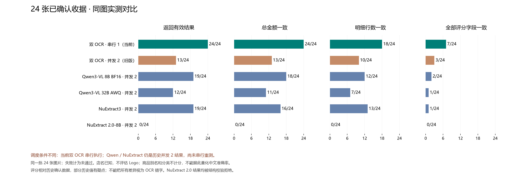

# 24 张已确认收据：传统双 OCR 与端到端模型对比

> 这是旧标准答案的历史结果。数据库修正后的最新评测见[新标准 OCR 对比](corrected_ocr_comparison.md)。

日期：2026-09-17。传统方案本轮重新读取全部 24 张原图；Qwen3-VL 和 NuExtract 使用此前归档结果。串行版调整了调度和 PP-OCR 中文优先规则；未修改原收据或标准答案。

**当前串行版：有效结果 24/24，总额一致 24/24，行数一致 18/24，全部字段一致 7/24。** 旧并发版有 11 张请求失败，保留该轮原始结果作为对照。

精度验收仍有 17/24 张存在差异或请求失败，全部结果已保存。返回有效结构不等于商品字段全部正确。

## 汇总

| 方案 | 有效结果 | 总额一致 | 行数一致 | 时间一致 | 全部字段一致 | 请求耗时中位数 |
| --- | ---: | ---: | ---: | ---: | ---: | ---: |
| 双 OCR · 串行 1（当前） | 24/24 | 24/24 | 18/24 | 18/24 | 7/24 | 71.82 秒 |
| 双 OCR · 并发 2（旧版） | 13/24 | 13/24 | 10/24 | 9/24 | 3/24 | 37.16 秒 |
| Qwen3-VL 8B BF16 · 并发 2 | 19/24 | 18/24 | 12/24 | 13/24 | 2/24 | 21.48 秒 |
| Qwen3-VL 32B AWQ · 并发 2 | 12/24 | 11/24 | 7/24 | 9/24 | 1/24 | 54.45 秒 |
| NuExtract3 · 并发 2 | 19/24 | 16/24 | 13/24 | 11/24 | 1/24 | 10.10 秒 |
| NuExtract 2.0-8B · 并发 2 | 0/24 | 0/24 | 0/24 | 0/24 | 0/24 | 14.83 秒 |

传统方案整批耗时：**875.02 秒**（客户端并发提交 2，服务端单任务串行，包括启动测试程序）。请求耗时包含服务排队，不能理解为纯模型计算速度。

## 方法与边界

**调度条件未统一：当前双 OCR 服务串行 1；旧双 OCR、Qwen 和 NuExtract 的请求并发均为 2，Qwen/NuExtract 的 vLLM max_sequences 也为 2。后者尚未做串行重测；不能把图表当成控制了并发变量的纯模型排名。**

具体错字、解析缺陷及确认数据疑点见 [双 OCR 细节分析](dual_ocr_error_analysis.md)。本次只更新图表说明与证据分析，不重新运行模型、不修改评分或确认数据。

- 当前链路为 Unlimited-OCR + PP-OCRv6 medium → Rust 店铺解析 → 结构校验及单位转换。没有语言模型负责结构化。
- 所有归档均核对 24 个收据 ID 与每张照片的 SHA-256；店铺为 Costco 10、SkyFoods 7、H Mart 3、99 Ranch 2、Feilong 1、Target 1。
- 使用相同确认数据与评分口径；模型只获得照片、已知店名、国家和币种，不获得商品答案。本轮不评估 Logo。
- 逐项比较票面名称、金额、种类、折扣关联、已知 SKU/税码/数量/单价/重量/单位、币种与交易时间；忽略用户别名、分类和未知可选字段。
- 严格一致率不是文字准确率。用户保存的数据可能带有历史默认值；没有为本次提高分数而更改答案。传统规则已根据部分历史样本调整，结果是回归表现，不能代表未知收据的泛化能力。
- NuExtract 2.0 的 24 次结果均未通过净额/折扣关联校验，不代表每个字符均未识别。InternVL 未完成实测，不计入图表。
- 每张收据一张照片；这组结果不能证明多图长收据表现。各方案的重试、图像处理和计算部署不同，耗时仅供部署参考。

## 逐张差异数

“失败”表示未返回可评分结果；数字是字段差异条数，不是错误商品数。

| 收据 | 店铺 | 双 OCR 串行 | 双 OCR 旧并发 | Qwen 8B | Qwen 32B | NuExtract3 | NuExtract2 |
| --- | --- | ---: | ---: | ---: | ---: | ---: | ---: |
| `2f97fc50` | 99 Ranch | 29 | 29 | 失败 | 失败 | 28 | 失败 |
| `72a635b2` | Feilong | 7 | 7 | 7 | 7 | 失败 | 失败 |
| `e3843baa` | H MART | 2 | 失败 | 2 | 失败 | 1 | 失败 |
| `4e491343` | Costco | 0 | 0 | 1 | 0 | 1 | 失败 |
| `6d9da1ec` | skyFOODS | 16 | 失败 | 25 | 29 | 失败 | 失败 |
| `e6c62f11` | Costco | 9 | 9 | 36 | 21 | 19 | 失败 |
| `73953603` | skyFOODS | 2 | 失败 | 失败 | 失败 | 2 | 失败 |
| `d7f8ff6d` | skyFOODS | 4 | 4 | 3 | 3 | 11 | 失败 |
| `a31f7e6b` | skyFOODS | 9 | 失败 | 7 | 11 | 失败 | 失败 |
| `8572dcef` | Costco | 5 | 5 | 8 | 5 | 6 | 失败 |
| `3a8e3c19` | Costco | 6 | 失败 | 9 | 失败 | 21 | 失败 |
| `e9ee06e0` | skyFOODS | 12 | 12 | 12 | 失败 | 12 | 失败 |
| `924e246e` | Costco | 0 | 失败 | 失败 | 失败 | 0 | 失败 |
| `e297a3d3` | H MART | 0 | 0 | 失败 | 失败 | 3 | 失败 |
| `a6618e05` | H MART | 0 | 失败 | 失败 | 失败 | 6 | 失败 |
| `ebf82f5b` | skyFOODS | 12 | 12 | 13 | 15 | 失败 | 失败 |
| `5331c892` | skyFOODS | 7 | 失败 | 6 | 失败 | 8 | 失败 |
| `20267232` | Costco | 2 | 2 | 3 | 3 | 3 | 失败 |
| `c5fdc978` | Costco | 0 | 失败 | 0 | 失败 | 4 | 失败 |
| `ca76c352` | Costco | 2 | 2 | 2 | 失败 | 2 | 失败 |
| `4fc6a91b` | Costco | 0 | 失败 | 0 | 失败 | 4 | 失败 |
| `6dd0be7d` | Costco | 0 | 0 | 2 | 2 | 2 | 失败 |
| `1b072114` | 99 Ranch | 33 | 失败 | 30 | 32 | 失败 | 失败 |
| `b69bb2c5` | Target | 3 | 3 | 2 | 3 | 2 | 失败 |

## 当前传统方案按店铺拆分

| 店铺 | 样本 | 有效结果 | 总额一致 | 行数一致 | 全部字段一致 |
| --- | ---: | ---: | ---: | ---: | ---: |
| 99 Ranch | 2 | 2 | 2 | 0 | 0 |
| Costco | 10 | 10 | 10 | 10 | 5 |
| Feilong | 1 | 1 | 1 | 0 | 0 |
| H MART | 3 | 3 | 3 | 2 | 2 |
| Target | 1 | 1 | 1 | 1 | 0 |
| skyFOODS | 7 | 7 | 7 | 5 | 0 |

## 当前失败与差异

本轮 24 张全部返回有效结构，其中包含上一轮失败的全部 11 张；每张原始响应均保留两种 OCR 输出，没有降级成单模型成功。

旧并发版的底层传输异常当时未记录，不能精确归因。独立诊断中 11 张的两个模型全部正常结束；本轮改为单任务、双模型依次执行，并补充安全的失败日志。详见 [诊断与串行处理说明](ocr_serial_processing.md)。

`e6c62f11` 的差异集中在折扣行的数量、单价及单位；`2f97fc50` 存在日期、优惠拆分及数量等差异。严格指标保留这些差异，没有为了分数调整评分口径。

## 原始证据与重现

- [完整本轮结果](../tests/backend_api/corpus/baselines/2026-09-17-serial-dual-ocr/report.json)、[汇总数据](../tests/backend_api/corpus/baselines/2026-09-17-serial-dual-ocr/summary.json)、[镜像与源文件哈希](../tests/backend_api/corpus/baselines/2026-09-17-serial-dual-ocr/deployment.json)。同目录保留测试日志、解析器和评分器源码。
- [Qwen 原始评测](confirmed_model_evaluation.md)、[NuExtract 原始评测](candidate_model_evaluation.md)、[测试运行说明](../tests/backend_api/corpus/README.md)。
- 使用 `python3 tests/backend_api/corpus/compare_confirmed.py` 从归档重建本报告及 PNG/SVG 图表；需要 Matplotlib 和本机微软雅黑字体。
