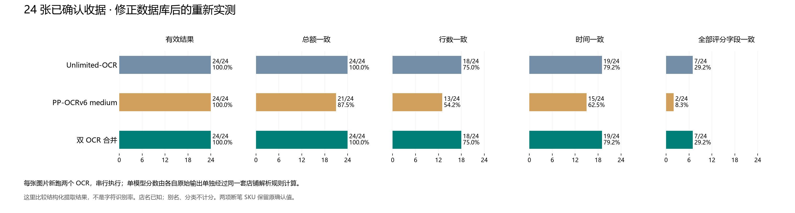

# 修正确认数据后的 OCR 评测

> 后续评测：[32 张原图、以票面名称为标准的 Qwen3.8 Q4_K_M 比较](qwen38_q4_evaluation.md)。本页保留 2026-09-17 的历史确认字段口径。

日期：2026-09-17。数据库中的明确错误已经按用户核对结果保存；从修正后的数据库重新冻结全部已确认收据，共 24 张、24 张照片。



## 结果

| 方案 | 有效结果 | 总額一致 | 行数一致 | 时间一致 | 全部评分字段一致 |
| --- | ---: | ---: | ---: | ---: | ---: |
| Unlimited-OCR | 24/24（100.0%） | 24/24（100.0%） | 18/24（75.0%） | 19/24（79.2%） | 7/24（29.2%） |
| PP-OCRv6 medium | 24/24（100.0%） | 21/24（87.5%） | 13/24（54.2%） | 15/24（62.5%） | 2/24（8.3%） |
| 双 OCR 合并 | 24/24（100.0%） | 24/24（100.0%） | 18/24（75.0%） | 19/24（79.2%） | 7/24（29.2%） |

整批新推理耗时 **990.77 秒**。每个任务依次运行 Unlimited-OCR 和 PP-OCR；客户端两个待处理请求进入服务端串行队列。耗时包含排队，不用于比较单个模型速度。

Unlimited 与合并分支的五项汇总相同，但具体结果并非完全相同：Costco ca76c352 的 BLUEBERRIES 被 PP 纠正。该张仍有时间差异，所以整张严格通过数未增加。中文标准名称未作为本轮评分答案，不能用这张表否定 PP 的中文识别价值。

## 标准答案与可比性

- 3 张 SkyFoods 共 6 条称重商品修正数量、单价、单位和重量；Costco 的 BLUERRIES 改为 BLUEBERRIES。H Mart 晚上 21:32 的交易时间在操作前已修正，本次保留。金额没有改动。
- [修正记录](confirmed_data_manual_review.md)；[新标准答案](../tests/backend_api/corpus/confirmed/2026-09-17-corrected/snapshot.json)；[写入前后实际数据](../tests/backend_api/corpus/baselines/2026-09-17-corrected-dual-ocr/corrections.json)。
- 所有 24 张均重新读取原图调用两个模型，没有复用上轮推理。本轮未调整生产解析规则来适配标准答案。
- 两个单模型分支只是离线隔离输入的评测：Unlimited 分支移除 PP 文字；PP 分支移除 Unlimited 文字；三者使用完全相同的解析器、单位换算和评分。线上仍要求每个任务运行两个模型。
- 离线双模型解析结果逐张与本轮线上 JSON 完全相同，防止评测实现和部署不一致。
- 逐项比较票面名称、商品种类、金额、重量、数量、单价、单位、SKU、税码、折扣关联，以及整张总额、币种和交易时间。未知可选值、用户别名和分类不计分；这不是文字字符准确率，也不能量化中文准确率。
- 店名由确认记录提供，隔离店铺解析表现，不评估 Logo。每张只有一张照片，不代表长收据多图结果。解析器开发用过部分样本，这属于回归评测。
- Costco 8572dcef 两项断笔 SKU 没有唯一正确替代值，仍保留数据库原值作为本轮评分标准；相关差异需结合这一不确定性解释。
- 旧 Qwen/NuExtract 图表使用旧标准答案，保留为[历史结果](confirmed_ocr_comparison.md)，不能直接把旧分数和这里的新分数当作同标准模型排名。

## 逐张差异

数字为字段差异条数，不是错误商品数。下方原始记录含预测、规范化结果及每一条差异。

| 收据 | 店铺 | Unlimited | PP-OCR | 双模型 |
| --- | --- | ---: | ---: | ---: |
| `2f97fc50` | 99 Ranch | 29 | 33 | 29 |
| `72a635b2` | Feilong | 7 | 7 | 7 |
| `e3843baa` | H MART | 1 | 1 | 1 |
| `4e491343` | Costco | 0 | 16 | 0 |
| `6d9da1ec` | skyFOODS | 16 | 34 | 16 |
| `e6c62f11` | Costco | 9 | 41 | 9 |
| `73953603` | skyFOODS | 2 | 3 | 2 |
| `d7f8ff6d` | skyFOODS | 1 | 1 | 1 |
| `a31f7e6b` | skyFOODS | 9 | 9 | 9 |
| `8572dcef` | Costco | 5 | 13 | 5 |
| `3a8e3c19` | Costco | 6 | 13 | 6 |
| `e9ee06e0` | skyFOODS | 3 | 3 | 3 |
| `924e246e` | Costco | 0 | 11 | 0 |
| `e297a3d3` | H MART | 0 | 0 | 0 |
| `a6618e05` | H MART | 0 | 0 | 0 |
| `ebf82f5b` | skyFOODS | 12 | 14 | 12 |
| `5331c892` | skyFOODS | 1 | 1 | 1 |
| `20267232` | Costco | 2 | 8 | 2 |
| `c5fdc978` | Costco | 0 | 2 | 0 |
| `ca76c352` | Costco | 2 | 1 | 1 |
| `4fc6a91b` | Costco | 0 | 1 | 0 |
| `6dd0be7d` | Costco | 0 | 6 | 0 |
| `1b072114` | 99 Ranch | 33 | 33 | 33 |
| `b69bb2c5` | Target | 3 | 8 | 3 |

## 差异明细（双模型）

### 99 Ranch · 2f97fc50-4cf3-47e1-bd44-ea6de95c774c

```text
time: 0 != 1785364661000 (UTC milliseconds)
line_count: 5 != 9
line[0].amount_minor: 149 != 249
line[0].quantity_micros: null != 1000000
line[0].unit_price_scaled: null != 249000000
line[0].printed_amount_minor: null != 150
line[0].quantity_unit: null != "ea"
line[1].amount_minor: 150 != 248
line[1].quantity_micros: null != 1000000
line[1].unit_price_scaled: null != 248000000
line[1].printed_amount_minor: null != 149
line[1].quantity_unit: null != "ea"
line[2].amount_minor: 199 != 249
line[2].quantity_micros: null != 1000000
line[2].unit_price_scaled: null != 249000000
line[2].printed_amount_minor: null != 200
line[2].quantity_unit: null != "ea"
line[3].amount_minor: 200 != 248
line[3].quantity_micros: null != 1000000
line[3].unit_price_scaled: null != 248000000
line[3].printed_amount_minor: null != 199
line[3].quantity_unit: null != "ea"
line[4].quantity_micros: null != 1000000
line[4].unit_price_scaled: null != 799000000
line[4].quantity_unit: null != "ea"
line[5]: missing "NONGFU SPRING GF JASMINE TEA"
line[6]: missing "NONGFU SPRING GF JASMINE TEA"
line[7]: missing "BEIJING YOGURT PLAIN 60Z"
line[8]: missing "BEIJING YOGURT PLAIN 60Z"
```

### Feilong · 72a635b2-4b7e-4612-98ab-0f74d47fca59

```text
line_count: 9 != 8
line[1].quantity_micros: null != 2000000
line[1].quantity_unit: null != "ea"
line[3].quantity_micros: null != 3000000
line[3].quantity_unit: null != "ea"
line[5].quantity_unit: "count" != "ea"
line[7].name: "Tax:" != "TAX"
```

### H MART · e3843baa-904a-4bbf-bc21-278a1693d5c7

```text
line_count: 9 != 5
```

### skyFOODS · 6d9da1ec-c0fc-4905-82b4-4ebd11716b1c

```text
line[3].unit_price_scaled: null != 999000000
line[3].quantity_unit: "count" != "ea"
line[4].unit_price_scaled: null != 399000000
line[4].quantity_unit: "count" != "ea"
line[5].unit_price_scaled: null != 399000000
line[5].quantity_unit: "count" != "ea"
line[6].name: "L.K.K SUPEREME FIRST DRAW S" != "L.K.K SUPEREME FIRST DRAW $"
line[6].unit_price_scaled: null != 599000000
line[6].quantity_unit: "count" != "ea"
line[7].quantity_micros: null != 1000000
line[7].unit_price_scaled: null != -99000000
line[7].quantity_unit: null != "ea"
line[8].quantity_micros: null != 1000000
line[8].unit_price_scaled: null != -100000000
line[8].quantity_unit: null != "ea"
line[9].name: "Tax:" != "TAX"
```

### Costco · e6c62f11-3b8d-4ac0-a860-1756df0efa55

```text
line[2].quantity_micros: null != 1000000
line[2].unit_price_scaled: null != -600000000
line[2].quantity_unit: null != "ea"
line[4].quantity_micros: null != 1000000
line[4].unit_price_scaled: null != -400000000
line[4].quantity_unit: null != "ea"
line[8].quantity_micros: null != 1000000
line[8].unit_price_scaled: null != -1100000000
line[8].quantity_unit: null != "ea"
```

### skyFOODS · 73953603-31f5-496a-9dd4-76fc845c8398

```text
line[2].quantity_unit: "count" != "ea"
line[4].name: "Tax:" != "TAX"
```

### skyFOODS · d7f8ff6d-6502-4eeb-8850-2f15b131988f

```text
line[3].name: "Tax:" != "TAX"
```

### skyFOODS · a31f7e6b-8bb1-49c8-a292-504d76d1a59c

```text
line_count: 6 != 5
line[0].unit_price_scaled: null != 699000000
line[0].quantity_unit: "count" != "ea"
line[1].unit_price_scaled: null != 699000000
line[1].quantity_unit: "count" != "ea"
line[2].amount_minor: 599 != 499
line[2].unit_price_scaled: null != 499000000
line[2].quantity_unit: "count" != "ea"
line[4].name: "Tax:" != "TAX"
```

### Costco · 8572dcef-7f7f-4d77-80c6-0ede75d45fa3

```text
time: 0 != 1723331700000 (UTC milliseconds)
line[2].sku: "1752618" != "1752518"
line[6].name: "ORGNIC ES THG" != "ORGNIC BS THG"
line[6].sku: "22957" != "22967"
line[7].sku: "948403" != "948400"
```

### Costco · 3a8e3c19-e8d0-4ea8-8fa3-06e3cd5fcfd4

```text
line[4].quantity_micros: null != 1000000
line[4].unit_price_scaled: null != -500000000
line[4].quantity_unit: null != "ea"
line[6].quantity_micros: null != 1000000
line[6].unit_price_scaled: null != -500000000
line[6].quantity_unit: null != "ea"
```

### skyFOODS · e9ee06e0-f4aa-4c3c-812a-4e8abc21e3f0

```text
line[3].unit_price_scaled: null != 199000000
line[3].quantity_unit: "count" != "ea"
line[4].name: "Tax:" != "TAX"
```

### skyFOODS · ebf82f5b-c4e7-4a49-8ce7-927233bfde95

```text
line_count: 9 != 7
line[0].unit_price_scaled: null != 499000000
line[0].quantity_unit: "count" != "ea"
line[2].unit_price_scaled: null != 699000000
line[2].quantity_unit: "count" != "ea"
line[3].unit_price_scaled: null != 300000000
line[3].quantity_unit: "count" != "ea"
line[4].unit_price_scaled: null != 299000000
line[4].quantity_unit: "count" != "ea"
line[5].unit_price_scaled: null != 2799000000
line[5].quantity_unit: "count" != "ea"
line[6].name: "Tax:" != "TAX"
```

### skyFOODS · 5331c892-9fb6-42b5-bdb3-5a205b1a0767

```text
line[2].name: "Tax:" != "TAX"
```

### Costco · 20267232-d4d0-4540-9c14-b0e051b06445

```text
time: 0 != 1788638580000 (UTC milliseconds)
line[0].name: "PASTURE E GS" != "PASTURE EGGS"
```

### Costco · ca76c352-9601-498c-8324-0ef9bcf5ea3b

```text
time: 0 != 1788385500000 (UTC milliseconds)
```

### 99 Ranch · 1b072114-24ee-4bb5-80a5-018ce442a512

```text
time: 0 != 1786997287000 (UTC milliseconds)
line_count: 10 != 13
line[0].amount_minor: 1599 != 1999
line[0].quantity_micros: null != 1000000
line[0].unit_price_scaled: null != 1999000000
line[0].printed_amount_minor: null != 1599
line[0].quantity_unit: null != "ea"
line[1].quantity_micros: null != 1000000
line[1].unit_price_scaled: null != 899000000
line[1].quantity_unit: null != "ea"
line[2].quantity_micros: null != 1000000
line[2].unit_price_scaled: null != 999000000
line[2].quantity_unit: null != "ea"
line[3].amount_minor: 249 != 349
line[3].quantity_micros: null != 1000000
line[3].unit_price_scaled: null != 349000000
line[3].printed_amount_minor: null != 250
line[3].quantity_unit: null != "ea"
line[4].amount_minor: 250 != 348
line[4].quantity_micros: null != 1000000
line[4].unit_price_scaled: null != 348000000
line[4].printed_amount_minor: null != 249
line[4].quantity_unit: null != "ea"
line[9].name: "TAX:$8.875% [$18.98]" != "MOGAMI 8-BLEND WHOLEGRAIN R"
line[9].kind: "product" != "item_discount"
line[9].amount_minor: 168 != -400
line[9].quantity_micros: null != 1000000
line[9].unit_price_scaled: null != -400000000
line[9].quantity_unit: null != "ea"
line[10]: missing "ASN/TAS ORGANIC SOY BEAN PEA"
line[11]: missing "ASN/TAS ORGANIC SOY BEAN PEA"
line[12]: missing "TAX"
line[9].discount_target: wrong product
```

### Target · b69bb2c5-7c75-4870-803e-25e321e086dd

```text
line[0].name: "284-30632 FAGE" != "FAGE"
line[0].quantity_unit: "count" != "ea"
line[1].kind: "product" != "tax"
```

## 可追溯输出

- [原始双 OCR 响应](../tests/backend_api/corpus/baselines/2026-09-17-corrected-dual-ocr/report.json)
- [Unlimited 单独解析](../tests/backend_api/corpus/baselines/2026-09-17-corrected-dual-ocr/unlimited.json)
- [PP-OCR 单独解析](../tests/backend_api/corpus/baselines/2026-09-17-corrected-dual-ocr/paddle.json)
- [双模型解析](../tests/backend_api/corpus/baselines/2026-09-17-corrected-dual-ocr/both.json)
- [部署、源码及标准答案哈希](../tests/backend_api/corpus/baselines/2026-09-17-corrected-dual-ocr/deployment.json)
