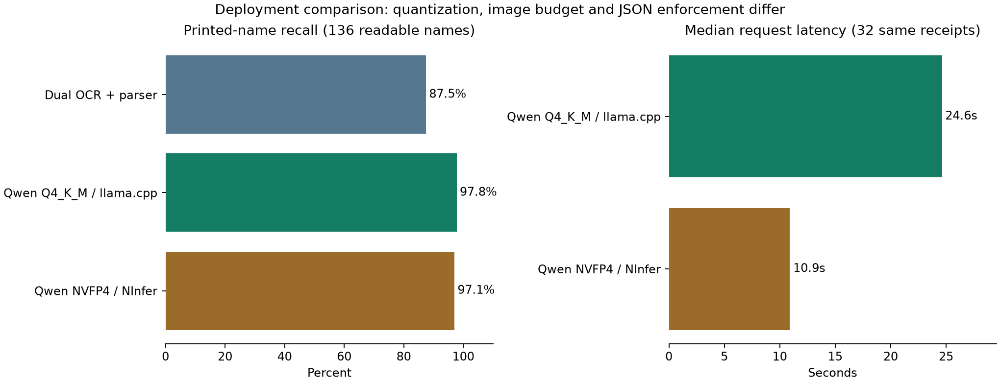

后续复测：[Hualian/TOTAL 提示与 thinking](ninfer_prompt_thinking_evaluation.md)。

# NInfer / Qwen3.8 收据实测

日期：2026-09-18。使用上一轮完全相同的 **32 张收据原图**、票面名称标注和通用/商店提示规则。原确认数据库、照片与生产识别配置未修改。

## 结论

**NInfer 已跑通。该部署配置明显更快，票面名称精度与上一轮接近，称重关联有所改善，仍不能直接替代现有双 OCR + parser。** 32 张耗时从 14.8 分钟降至 7.0 分钟；单张中位数从 24.6 秒降至 10.9 秒（约 2.26 倍）。名称少命中 1 个，已知重量关联多命中 4 个。样本较少且配置不同，这些差异不代表统计显著或引擎本身带来的提升。

## 结果

下表 NInfer 为**仅去掉外层 Markdown 代码框后**的结果，没有改字、补金额、修复 JSON 或重试推理。整张名称完全正确率只计所有名称可辨认的 28 张；8 个无法确定的名称不计入 136 个名称的分母。

| 方案 | 票面名称命中 | 名称整张完全正确 | 商品行数正确 | 总额与确认记录一致 | 名称+金额+重量组合命中 |
| --- | ---: | ---: | ---: | ---: | ---: |
| Dual OCR + parser | 119/136（87.5%） | 18/28 | 28/32 | 32/32 | 20/20 |
| Qwen Q4_K_M / llama.cpp | 133/136（97.8%） | 26/28 | 31/32 | 31/32 | 13/20 |
| Qwen NVFP4 / NInfer | 132/136（97.1%） | 25/28 | 31/32 | 31/32 | 17/20 |

金额和重量仍以冻结的确认字段作辅助核验；名称以原图核验标注为准。重量只覆盖确认记录中已有明确重量的 20 行，不代表全部称重行。此处增加商品名称绑定条件，避免把正确重量放到错误商品仍计为命中。

## 速度

| 指标 | 上一轮 llama.cpp / Q4_K_M | NInfer / NVFP4 |
| --- | ---: | ---: |
| 32 张批次耗时 | 887.8 秒 | 418.4 秒 |
| 单张请求中位数 | 24.6 秒 | 10.9 秒 |
| 单张请求范围 | 8.0–49.6 秒 | 5.8–17.9 秒 |
| 输入 token 中位数 | 5756 | 14828 |

NInfer 的单张请求中位数约为上一轮的 **44.3%**，即快 **2.26 倍**。请求计时包括本地传输、图像处理和推理；批次还包括客户端图片编码。两轮均串行、不重试、无独立预热，模型加载与本轮编译/下载不计入。双 OCR 本轮使用缓存重新解析，不参与速度比较。

## 接口问题：没有强制 JSON 输出

NInfer 本轮原始回复中，能直接解析成 JSON 对象的有 **2/32**；格式适配后能解析 **32/32**，其中 **32/32** 通过相同的后端结构校验与规范化。

[NInfer 的 API 文档](https://github.com/Neroued/ninfer/blob/9e163eee4b8acec21ab0ac765107b6a3f287b217/docs/serving.md)明确不支持 JSON Schema 约束解码，仅接受 `response_format=text`。因此把同一 schema 加入提示文字，请求“只输出 JSON”。模型仍可能加代码框。离线适配只允许完整回复是单个 JSON 代码框；不从解释文字中猜测截取 JSON，不接受截断结果，也不改任何字段。原始失败和原始回复都已保留。

这意味着不能把 NInfer 原样替换现有结构化接口。接入时至少需要格式适配、schema 校验和金额/重量校验，不能把“能解析 JSON”当成“数据正确”。

## 具体改善与错误

- **Costco `c00860de`**：上一轮的 `CHICALAFREDO` 本轮正确读成票面 `CHICALFREDO`；`YLW NECTARIN` 仍误读为 `YLM NECTARIN`。
- **99 Ranch `1b072114`**：两行票面 `BIGEN` 本轮都漏掉 `I`，读成 `BGEN`，上一轮这两行正确。本轮同时提取出了四项称重信息，保留优惠关联和净额语义，避免上一轮重复扣优惠的问题。
- **Costco `8572dcef`**：两轮都把 `ORGNC BS THG` 读成 `DRGNC BS THG`，并把卡支付额 **$123.80** 当成总消费；确认总消费为 **$138.03**，差 **$14.23**。商品名称识别较好并不意味着金额逻辑正确。
- **Hualian `fe3a7e41`**：仍将一项蓝莓的名称续行拆成额外商品，6 项变 7 项，多出 **$1.86**。本轮读到了重量，却把 **0.50 lb** 关联给醋、**0.76 lb** 给 CHINESE LEEK、**2.69 lb** 给额外蓝莓行；正确关联应分别为 CHINESE LEEK、CHIVES、CHINESE CABBAGE。若仅比较金额与重量组合，会虚增一个命中，因此本报告同时绑定名称核验。
- **99 Ranch `78f63611`**：苹果 **2.65 lb @ $2.99/lb** 本轮读出，上一轮漏重量。
- **HMART `199fc34a`**：苹果 **2.91 lb @ $2.99/lb** 与香蕉 **3.11 lb @ $1.29/lb** 本轮关联正确，上一轮把香蕉重量给了苹果。
- **SkyFoods `d7f8ff6d`**：TAIWAN CABBAGE 的已确认重量本轮正确提取，上一轮缺失。

以上是原始输出及同一后端规范化结果的逐例对照，没有根据这些错误再修改提示或重新生成答案。名称指标之外的所有字段仍需独立校验；本次未把 SKU、税码、日期和中文续行计成综合正确率。

## 配置与可比性

- [NInfer](https://github.com/Neroued/ninfer) 固定 commit `9e163eee4b8acec21ab0ac765107b6a3f287b217`；CUDA 13.1.2；在本机 RTX 5090 32 GB 上容器化运行。
- 模型：[neroued/Qwen3.8-27B-nvfp4-NInfer](https://huggingface.co/neroued/Qwen3.8-27B-nvfp4-NInfer)，revision `f0b43ad436b9fa8142c6ed6647c470a6fe409484`；文件 SHA256 `74d2c57145e6ff11d1d2faa79594477f9bc903a611af1fb20218189fbbb77d82` 已校验。模型是混合 NVFP4/FP8 权重，不是上一轮 GGUF Q4_K_M。
- thinking 关闭、temperature 0、seed 42、上下文与 KV 容量 32768、FP8 KV、并发 1、MTP 3-token 推测解码、优化 proposal head、最大输出 8192 token。
- 同样先 EXIF 调正原图再传 PNG。NInfer 使用模型自带 16,777,216 像素上限；原图约 12.5 MP，而上一轮 llama.cpp 限制 4096 图像 token。因此分辨率、量化、模板与结构化输出机制都不同，**这是实际部署配置对比，不能把精度或速度差异全部归因于引擎**。
- 一次设备显存采样为 26,819 MiB（约 26.2 GiB），不是峰值。模型运行时只发布本机回环测试端口；原 backend_api 保持运行，双 OCR 暂停让出 GPU，测试后恢复。
- 沿用[原图票面名称标注](../tests/backend_api/corpus/annotations/2026-09-18-printed-names.json)，不使用商品名称作为文字答案。标注由 Codex 逐图核验，未经过用户独立复核；未评测中文续行逐字准确率、Logo、多图长收据或新商店泛化。

## 逐张票面名称

| 收据 | 商店 | 双 OCR | llama.cpp Q4_K_M | NInfer NVFP4 | NInfer 商品行数/原图 |
| --- | --- | ---: | ---: | ---: | ---: |
| [57bb2995](../tests/backend_api/corpus/baselines/2026-09-18-qwen38-q4/images/57bb2995-1993-4ff0-863e-43764ee31526-0.jpg) | Costco | 5/6 | 6/6 | 6/6 | 6/6 |
| [834a4c6e](../tests/backend_api/corpus/baselines/2026-09-18-qwen38-q4/images/834a4c6e-9307-40bb-acf6-c143c5f41e73-0.jpg) | skyFOODS | 7/8 | 8/8 | 8/8 | 10/10 |
| [560ccf19](../tests/backend_api/corpus/baselines/2026-09-18-qwen38-q4/images/560ccf19-b7af-4ad6-a512-1dd51853f4d8-0.jpg) | Costco | 7/7 | 7/7 | 7/7 | 7/7 |
| [74356ee7](../tests/backend_api/corpus/baselines/2026-09-18-qwen38-q4/images/74356ee7-d2e7-42e4-aea1-8fa567dec8ea-0.jpg) | skyFOODS | 4/4 | 4/4 | 4/4 | 4/4 |
| [78f63611](../tests/backend_api/corpus/baselines/2026-09-18-qwen38-q4/images/78f63611-ad9f-4982-86aa-7b16450f46a7-0.jpg) | 99 Ranch | 1/1 | 1/1 | 1/1 | 1/1 |
| [2f97fc50](../tests/backend_api/corpus/baselines/2026-09-18-qwen38-q4/images/2f97fc50-4cf3-47e1-bd44-ea6de95c774c-0.jpg) | 99 Ranch | 3/3 | 3/3 | 3/3 | 5/5 |
| [72a635b2](../tests/backend_api/corpus/baselines/2026-09-18-qwen38-q4/images/72a635b2-4b7e-4612-98ab-0f74d47fca59-0.jpg) | Feilong | 0/7 | 7/7 | 7/7 | 7/7 |
| [fe3a7e41](../tests/backend_api/corpus/baselines/2026-09-18-qwen38-q4/images/fe3a7e41-45ad-4865-8a83-427a696481db-0.jpg) | Hualian | 5/5 | 5/5 | 5/5 | 7/6 |
| [e3843baa](../tests/backend_api/corpus/baselines/2026-09-18-qwen38-q4/images/e3843baa-904a-4bbf-bc21-278a1693d5c7-0.jpg) | H MART | 4/4 | 4/4 | 4/4 | 4/4 |
| [199fc34a](../tests/backend_api/corpus/baselines/2026-09-18-qwen38-q4/images/199fc34a-4857-4aac-873c-8c55f8b223a9-0.jpg) | H MART | 5/5 | 5/5 | 5/5 | 5/5 |
| [4e491343](../tests/backend_api/corpus/baselines/2026-09-18-qwen38-q4/images/4e491343-7593-42b4-b5b5-01e5648557ee-0.jpg) | Costco | 4/4 | 4/4 | 4/4 | 4/4 |
| [c00860de](../tests/backend_api/corpus/baselines/2026-09-18-qwen38-q4/images/c00860de-60e8-4892-8bc3-1e0b2c8314ab-0.jpg) | Costco | 3/7 | 5/7 | 6/7 | 7/7 |
| [6d9da1ec](../tests/backend_api/corpus/baselines/2026-09-18-qwen38-q4/images/6d9da1ec-c0fc-4905-82b4-4ebd11716b1c-0.jpg) | skyFOODS | 7/7 | 7/7 | 7/7 | 7/7 |
| [e6c62f11](../tests/backend_api/corpus/baselines/2026-09-18-qwen38-q4/images/e6c62f11-3b8d-4ac0-a860-1756df0efa55-0.jpg) | Costco | 8/8 | 8/8 | 8/8 | 8/8 |
| [73953603](../tests/backend_api/corpus/baselines/2026-09-18-qwen38-q4/images/73953603-31f5-496a-9dd4-76fc845c8398-0.jpg) | skyFOODS | 4/4 | 4/4 | 4/4 | 4/4 |
| [d7f8ff6d](../tests/backend_api/corpus/baselines/2026-09-18-qwen38-q4/images/d7f8ff6d-6502-4eeb-8850-2f15b131988f-0.jpg) | skyFOODS | 3/3 | 3/3 | 3/3 | 3/3 |
| [a31f7e6b](../tests/backend_api/corpus/baselines/2026-09-18-qwen38-q4/images/a31f7e6b-8bb1-49c8-a292-504d76d1a59c-0.jpg) | skyFOODS | 4/4 | 4/4 | 4/4 | 4/4 |
| [8572dcef](../tests/backend_api/corpus/baselines/2026-09-18-qwen38-q4/images/8572dcef-7f7f-4d77-80c6-0ede75d45fa3-0.jpg) | Costco | 8/9 | 8/9 | 8/9 | 9/9 |
| [3a8e3c19](../tests/backend_api/corpus/baselines/2026-09-18-qwen38-q4/images/3a8e3c19-e8d0-4ea8-8fa3-06e3cd5fcfd4-0.jpg) | Costco | 5/5 | 5/5 | 5/5 | 5/5 |
| [e9ee06e0](../tests/backend_api/corpus/baselines/2026-09-18-qwen38-q4/images/e9ee06e0-f4aa-4c3c-812a-4e8abc21e3f0-0.jpg) | skyFOODS | 4/4 | 4/4 | 4/4 | 4/4 |
| [924e246e](../tests/backend_api/corpus/baselines/2026-09-18-qwen38-q4/images/924e246e-c811-497a-a61b-6b5724f7bacd-0.jpg) | Costco | 2/2 | 2/2 | 2/2 | 2/2 |
| [e297a3d3](../tests/backend_api/corpus/baselines/2026-09-18-qwen38-q4/images/e297a3d3-f9f1-4ba7-8e5e-a18e56fdecdd-0.jpg) | H MART | 1/1 | 1/1 | 1/1 | 1/1 |
| [a6618e05](../tests/backend_api/corpus/baselines/2026-09-18-qwen38-q4/images/a6618e05-1d59-453f-90e9-4bbf87a3830c-0.jpg) | H MART | 2/2 | 2/2 | 2/2 | 2/2 |
| [ebf82f5b](../tests/backend_api/corpus/baselines/2026-09-18-qwen38-q4/images/ebf82f5b-c4e7-4a49-8ce7-927233bfde95-0.jpg) | skyFOODS | 6/6 | 6/6 | 6/6 | 6/6 |
| [5331c892](../tests/backend_api/corpus/baselines/2026-09-18-qwen38-q4/images/5331c892-9fb6-42b5-bdb3-5a205b1a0767-0.jpg) | skyFOODS | 2/2 | 2/2 | 2/2 | 2/2 |
| [20267232](../tests/backend_api/corpus/baselines/2026-09-18-qwen38-q4/images/20267232-d4d0-4540-9c14-b0e051b06445-0.jpg) | Costco | 0/0 | 0/0 | 0/0 | 3/3 |
| [c5fdc978](../tests/backend_api/corpus/baselines/2026-09-18-qwen38-q4/images/c5fdc978-8f74-43bf-a5c5-e22d28f5aea9-0.jpg) | Costco | 1/1 | 1/1 | 1/1 | 1/1 |
| [ca76c352](../tests/backend_api/corpus/baselines/2026-09-18-qwen38-q4/images/ca76c352-9601-498c-8324-0ef9bcf5ea3b-0.jpg) | Costco | 2/3 | 3/3 | 3/3 | 3/3 |
| [4fc6a91b](../tests/backend_api/corpus/baselines/2026-09-18-qwen38-q4/images/4fc6a91b-faba-4d3e-82a3-be4c78270e99-0.jpg) | Costco | 1/1 | 1/1 | 1/1 | 1/1 |
| [6dd0be7d](../tests/backend_api/corpus/baselines/2026-09-18-qwen38-q4/images/6dd0be7d-4b6e-4b97-8a3d-c76de14f434c-0.jpg) | Costco | 2/3 | 3/3 | 3/3 | 3/3 |
| [1b072114](../tests/backend_api/corpus/baselines/2026-09-18-qwen38-q4/images/1b072114-24ee-4bb5-80a5-018ce442a512-0.jpg) | 99 Ranch | 9/9 | 9/9 | 7/9 | 9/9 |
| [b69bb2c5](../tests/backend_api/corpus/baselines/2026-09-18-qwen38-q4/images/b69bb2c5-7c75-4870-803e-25e321e086dd-0.jpg) | Target | 0/1 | 1/1 | 1/1 | 1/1 |

[完整指标及差异](../tests/backend_api/corpus/baselines/2026-09-18-ninfer/summary.json) · [原始输出记录](../tests/backend_api/corpus/baselines/2026-09-18-ninfer/raw-report.json) · [格式适配后记录](../tests/backend_api/corpus/baselines/2026-09-18-ninfer/adapted-report.json) · [部署记录](../tests/backend_api/corpus/baselines/2026-09-18-ninfer/deployment.json)

## 复现与检查

临时镜像与服务定义分别为 [Dockerfile](../docker/ninfer_evaluation.Dockerfile)、[Compose](../docker/ninfer_evaluation.compose.yaml)。启动前应确认没有排队的生产 OCR 任务，并停原 OCR 让出 GPU；评测后恢复。不要同时加载两个服务争用显存。

评测入口 `tests/backend_api/qwen38_evaluation.py` 使用 `--output-mode prompt`；上一轮 llama.cpp 使用 `--output-mode schema`。格式适配由 `tests/backend_api/candidate_json_format.py` 完成，原始结果保留不覆盖，再经 `candidate_comparison_benchmark` 调用同一 Rust 后端校验与规范化。输入快照与照片复用上一轮归档，不把标准商品字段传给模型。

验证完成：评测及名称计分 6 个单元测试、格式适配 3 个单元测试、32 张候选的 Rust 隔离规范化测试均通过。这里的测试通过代表流程与校验正常，不代表 OCR 每个字段正确。测试后临时 NInfer 容器已移除，原 backend_api 与 backend_ocr 均恢复 healthy；确认记录未被改写。
