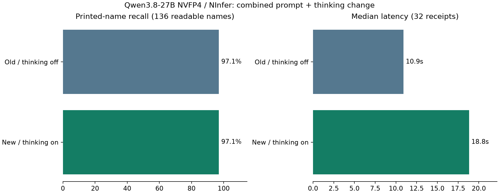

# NInfer：Hualian 专用提示、TOTAL 规则与 thinking 复测

2026-09-18。沿用同一 32 张原图、原图票面名称标注、NInfer commit、Qwen3.8-27B NVFP4 模型、图像处理和串行运行配置。没有修改 playground 收据。

## 结论

**新提示＋thinking 修正了本次关注的 Hualian 称重/续行问题和 Costco 总额问题，但还不能直接作为可用性更高的替代方案。** 原始总额命中从 31/32 到 32/32，商品行数从 31/32 到 32/32；票面名称仍为 132/136。两张输出新增了不允许的字段，后端接受率从 32/32 降为 30/32。单张中位耗时从 10.9 秒升到 18.8 秒，增加约 72%；整批从 7.0 分钟升到 12.8 分钟。

## 结果

| 配置 | 票面名称命中 | 整张名称完全正确 | 商品行数正确 | 后端接受且总额一致 | 名称+金额+重量组合命中 | 请求中位耗时 |
| --- | ---: | ---: | ---: | ---: | ---: | ---: |
| Old / thinking off | 132/136 (97.1%) | 25/28 | 31/32 | 31/32 | 17/20 | 10.9 秒 |
| New / thinking on | 132/136 (97.1%) | 25/28 | 32/32 | 30/32 | 19/20 | 18.8 秒 |

票面名称和商品行数直接检查模型输出，包含后端拒绝的两张；这不是完整可用率。模型原始总额与确认值一致为 32/32，而后端接受且总额一致为 30/32。

名称基准为照片上的票面文字，不是商品名称或历史数据库文字。136 个可辨认名称计入命中率；8 个不确定名称排除；整张名称仅评估 28 张全部可辨认收据。重量和总额以冻结确认字段为辅助基准；20 个已知称重行并不覆盖所有实际称重行，不能当全量重量准确率。没有评测中文续行逐字准确率。

## 具体样本

### Hualian `fe3a7e41`：本次目标已改善

商品由错误的 7 项恢复为 6 项，蓝莓的英文续行不再被拆成多余的 $1.86 商品。醋不带称重信息，三条重量分别关联正确：

| 商品 | 本轮重量 × 单价 | 票面金额 |
| --- | --- | ---: |
| CHINESE LEEK | 0.50 lb × $3.99/lb | $2.00 |
| CHIVES | 0.76 lb × $4.49/lb | $3.41 |
| CHINESE CABBAGE | 2.69 lb × $0.69/lb | $1.86 |

总额保留 $27.25，明细相加一致。这里说明这张已知问题样本得到修正；一张 Hualian 样本不能证明适用于所有版式。

### Costco `8572dcef`：总额已改善

本轮返回 **$138.03**，不再把卡支付 **$123.80** 当总额；`ORGNC BS THG` 也读对了。奖励抵扣属于支付环节，不减少这张收据的消费总额。

### 回退与剩余问题

- **协议回退**：Costco `4e491343`、`c00860de` 多出 `review_notes_top: null`。协议的 `additionalProperties: false` 不允许该字段，因此后端拒绝。这两张原始总额分别为 $73.25、$100.19，金额虽与确认值一致，整份结果仍不能算可用。未删字段来美化分数。
- **新增错字**：`560ccf19` 的 `COKEDEMEXICO` → `COKEDEMXICO`；`199fc34a` 的 `ENVY APPLE` → `ENVIY APPLE`。这两处上一轮正确。
- **仍然错字**：`1b072114` 两项 `BIGEN` 均读成 `BGEN`。
- **修正错字**：`c00860de` 的 `YLW NECTARIN`、`8572dcef` 的 `ORGNC BS THG` 本轮读对，因此总体名称命中率持平。
- **重量指标解释**：已知重量与金额组合为 20/20；再要求票面名称精确对应则为 19/20，差的一项正是 HMART 苹果名称多了 `I`。上一轮分别为 18/20、17/20。仅比较数值会漏掉名称或商品关联错误，主表采用更严格的组合。

## 本轮改动

1. 通用提示明确读取独立 `TOTAL` 标签后或正下方对应金额，排除 SUBTOTAL、TOTAL TAX、TOTAL SAVINGS、付款额、找零及奖励抵扣。缺少可靠证据时返回未知；不编造金额来凑平。
2. Hualian 独立提示：称重行先暂存，绑定下一条有独立右侧金额的商品，然后清空。该商品下面无价格的中英文续行属于同一商品；下一条称重行属于下一商品。乘法仅用于复核关联，不能修改打印金额。
3. 用户要求开启 thinking。本轮请求显式 `enable_thinking=true`，覆盖服务端非 thinking 默认值。总输出预算仍为 8192 token（包含思考与答案），上下文 32768，温度 0，seed 42，无重试。

这是**提示修改与 thinking 同时变化**的实验，不能把提升或回退单独归因于其中一项；未进行仅改提示或仅开 thinking 的消融对照。本轮新增提示没有写入样本中的具体商品名或金额答案；原有通用提示示例沿用，模型不接收历史 OCR 输出或确认字段答案。Hualian 和 Costco 是已经知道错误的调试样本，因此这是回归检查，不是独立盲测。已知商店仍由评测上下文提供；本轮不评测 Logo。

## 输出与性能

原始直接 JSON 对象 32/32；去掉单个完整外层代码框后 32/32；通过同一后端结构校验和规范化 30/32。保留所有原始输出、失败及思考字段，不修改字段值、不修复截断答案。

本轮 32/32 个响应包含非空独立 reasoning 字段，确认实际进行了思考。32 张批次耗时 767.3 秒，上一轮 418.4 秒。批次含图片编码和传输，不含模型加载；未独立预热。单次串行测量不能代表稳定生产延迟。

## 逐张结果

总额列以美分记录“后端规范化结果 / 确认值”；None 表示后端拒绝整份结果，不表示模型没有读出金额。名称、总额和商品行数分别计分，不代表所有字段同时正确。

| 原图 | 商店 | 上轮名称 | 本轮名称 | 本轮商品行数/应有 | 总额（美分） |
| --- | --- | ---: | ---: | ---: | ---: |
| [57bb2995](../tests/backend_api/corpus/baselines/2026-09-18-qwen38-q4/images/57bb2995-1993-4ff0-863e-43764ee31526-0.jpg) | Costco | 6/6 | 6/6 | 6/6 | 18611 / 18611 |
| [834a4c6e](../tests/backend_api/corpus/baselines/2026-09-18-qwen38-q4/images/834a4c6e-9307-40bb-acf6-c143c5f41e73-0.jpg) | skyFOODS | 8/8 | 8/8 | 10/10 | 5648 / 5648 |
| [560ccf19](../tests/backend_api/corpus/baselines/2026-09-18-qwen38-q4/images/560ccf19-b7af-4ad6-a512-1dd51853f4d8-0.jpg) | Costco | 7/7 | 6/7 | 7/7 | 11170 / 11170 |
| [74356ee7](../tests/backend_api/corpus/baselines/2026-09-18-qwen38-q4/images/74356ee7-d2e7-42e4-aea1-8fa567dec8ea-0.jpg) | skyFOODS | 4/4 | 4/4 | 4/4 | 1348 / 1348 |
| [78f63611](../tests/backend_api/corpus/baselines/2026-09-18-qwen38-q4/images/78f63611-ad9f-4982-86aa-7b16450f46a7-0.jpg) | 99 Ranch | 1/1 | 1/1 | 1/1 | 792 / 792 |
| [2f97fc50](../tests/backend_api/corpus/baselines/2026-09-18-qwen38-q4/images/2f97fc50-4cf3-47e1-bd44-ea6de95c774c-0.jpg) | 99 Ranch | 3/3 | 3/3 | 5/5 | 1497 / 1497 |
| [72a635b2](../tests/backend_api/corpus/baselines/2026-09-18-qwen38-q4/images/72a635b2-4b7e-4612-98ab-0f74d47fca59-0.jpg) | Feilong | 7/7 | 7/7 | 7/7 | 1477 / 1477 |
| [fe3a7e41](../tests/backend_api/corpus/baselines/2026-09-18-qwen38-q4/images/fe3a7e41-45ad-4865-8a83-427a696481db-0.jpg) | Hualian | 5/5 | 5/5 | 6/6 | 2725 / 2725 |
| [e3843baa](../tests/backend_api/corpus/baselines/2026-09-18-qwen38-q4/images/e3843baa-904a-4bbf-bc21-278a1693d5c7-0.jpg) | H MART | 4/4 | 4/4 | 4/4 | 3396 / 3396 |
| [199fc34a](../tests/backend_api/corpus/baselines/2026-09-18-qwen38-q4/images/199fc34a-4857-4aac-873c-8c55f8b223a9-0.jpg) | H MART | 5/5 | 4/5 | 5/5 | 5468 / 5468 |
| [4e491343](../tests/backend_api/corpus/baselines/2026-09-18-qwen38-q4/images/4e491343-7593-42b4-b5b5-01e5648557ee-0.jpg) | Costco | 4/4 | 4/4 | 4/4 | None / 7325 |
| [c00860de](../tests/backend_api/corpus/baselines/2026-09-18-qwen38-q4/images/c00860de-60e8-4892-8bc3-1e0b2c8314ab-0.jpg) | Costco | 6/7 | 7/7 | 7/7 | None / 10019 |
| [6d9da1ec](../tests/backend_api/corpus/baselines/2026-09-18-qwen38-q4/images/6d9da1ec-c0fc-4905-82b4-4ebd11716b1c-0.jpg) | skyFOODS | 7/7 | 7/7 | 7/7 | 3032 / 3032 |
| [e6c62f11](../tests/backend_api/corpus/baselines/2026-09-18-qwen38-q4/images/e6c62f11-3b8d-4ac0-a860-1756df0efa55-0.jpg) | Costco | 8/8 | 8/8 | 8/8 | 15492 / 15492 |
| [73953603](../tests/backend_api/corpus/baselines/2026-09-18-qwen38-q4/images/73953603-31f5-496a-9dd4-76fc845c8398-0.jpg) | skyFOODS | 4/4 | 4/4 | 4/4 | 971 / 971 |
| [d7f8ff6d](../tests/backend_api/corpus/baselines/2026-09-18-qwen38-q4/images/d7f8ff6d-6502-4eeb-8850-2f15b131988f-0.jpg) | skyFOODS | 3/3 | 3/3 | 3/3 | 421 / 421 |
| [a31f7e6b](../tests/backend_api/corpus/baselines/2026-09-18-qwen38-q4/images/a31f7e6b-8bb1-49c8-a292-504d76d1a59c-0.jpg) | skyFOODS | 4/4 | 4/4 | 4/4 | 2061 / 2061 |
| [8572dcef](../tests/backend_api/corpus/baselines/2026-09-18-qwen38-q4/images/8572dcef-7f7f-4d77-80c6-0ede75d45fa3-0.jpg) | Costco | 8/9 | 9/9 | 9/9 | 13803 / 13803 |
| [3a8e3c19](../tests/backend_api/corpus/baselines/2026-09-18-qwen38-q4/images/3a8e3c19-e8d0-4ea8-8fa3-06e3cd5fcfd4-0.jpg) | Costco | 5/5 | 5/5 | 5/5 | 25670 / 25670 |
| [e9ee06e0](../tests/backend_api/corpus/baselines/2026-09-18-qwen38-q4/images/e9ee06e0-f4aa-4c3c-812a-4e8abc21e3f0-0.jpg) | skyFOODS | 4/4 | 4/4 | 4/4 | 974 / 974 |
| [924e246e](../tests/backend_api/corpus/baselines/2026-09-18-qwen38-q4/images/924e246e-c811-497a-a61b-6b5724f7bacd-0.jpg) | Costco | 2/2 | 2/2 | 2/2 | 4785 / 4785 |
| [e297a3d3](../tests/backend_api/corpus/baselines/2026-09-18-qwen38-q4/images/e297a3d3-f9f1-4ba7-8e5e-a18e56fdecdd-0.jpg) | H MART | 1/1 | 1/1 | 1/1 | 1017 / 1017 |
| [a6618e05](../tests/backend_api/corpus/baselines/2026-09-18-qwen38-q4/images/a6618e05-1d59-453f-90e9-4bbf87a3830c-0.jpg) | H MART | 2/2 | 2/2 | 2/2 | 1939 / 1939 |
| [ebf82f5b](../tests/backend_api/corpus/baselines/2026-09-18-qwen38-q4/images/ebf82f5b-c4e7-4a49-8ce7-927233bfde95-0.jpg) | skyFOODS | 6/6 | 6/6 | 6/6 | 4823 / 4823 |
| [5331c892](../tests/backend_api/corpus/baselines/2026-09-18-qwen38-q4/images/5331c892-9fb6-42b5-bdb3-5a205b1a0767-0.jpg) | skyFOODS | 2/2 | 2/2 | 2/2 | 641 / 641 |
| [20267232](../tests/backend_api/corpus/baselines/2026-09-18-qwen38-q4/images/20267232-d4d0-4540-9c14-b0e051b06445-0.jpg) | Costco | 0/0 | 0/0 | 3/3 | 10077 / 10077 |
| [c5fdc978](../tests/backend_api/corpus/baselines/2026-09-18-qwen38-q4/images/c5fdc978-8f74-43bf-a5c5-e22d28f5aea9-0.jpg) | Costco | 1/1 | 1/1 | 1/1 | -1699 / -1699 |
| [ca76c352](../tests/backend_api/corpus/baselines/2026-09-18-qwen38-q4/images/ca76c352-9601-498c-8324-0ef9bcf5ea3b-0.jpg) | Costco | 3/3 | 3/3 | 3/3 | 6194 / 6194 |
| [4fc6a91b](../tests/backend_api/corpus/baselines/2026-09-18-qwen38-q4/images/4fc6a91b-faba-4d3e-82a3-be4c78270e99-0.jpg) | Costco | 1/1 | 1/1 | 1/1 | -5528 / -5528 |
| [6dd0be7d](../tests/backend_api/corpus/baselines/2026-09-18-qwen38-q4/images/6dd0be7d-4b6e-4b97-8a3d-c76de14f434c-0.jpg) | Costco | 3/3 | 3/3 | 3/3 | 9642 / 9642 |
| [1b072114](../tests/backend_api/corpus/baselines/2026-09-18-qwen38-q4/images/1b072114-24ee-4bb5-80a5-018ce442a512-0.jpg) | 99 Ranch | 7/9 | 7/9 | 9/9 | 5383 / 5383 |
| [b69bb2c5](../tests/backend_api/corpus/baselines/2026-09-18-qwen38-q4/images/b69bb2c5-7c75-4870-803e-25e321e086dd-0.jpg) | Target | 1/1 | 1/1 | 1/1 | 1758 / 1758 |

[上一轮报告](ninfer_evaluation.md) · [完整指标和逐例差异](../tests/backend_api/corpus/baselines/2026-09-18-ninfer-prompt-thinking/summary.json) · [本轮原始结果](../tests/backend_api/corpus/baselines/2026-09-18-ninfer-prompt-thinking/raw-report.json) · [部署记录](../tests/backend_api/corpus/baselines/2026-09-18-ninfer-prompt-thinking/deployment.json)

## 验证与服务状态

6 个评测与名称计分单元测试通过；32 张结果通过同一 Rust 隔离评测流程，逐张记录接受或拒绝，并非全部 OCR 答案正确。临时推理容器已移除，原 backend_api 和 backend_ocr 均 healthy。没有修改确认收据或切换线上识别方案。

新增 Hualian 提示在 [qwen38_hualian.txt](../tests/backend_api/corpus/baselines/2026-09-18-ninfer-prompt-thinking/qwen38_hualian.txt)，通用 TOTAL 规则在 [qwen38_receipt.txt](../tests/backend_api/corpus/baselines/2026-09-18-ninfer-prompt-thinking/qwen38_receipt.txt)。评测入口新增必选 `--thinking on|off`，本轮 `on`；原始响应、各样本完整提示、评分与运行配置均保留在本轮归档，旧基线保持不变。
