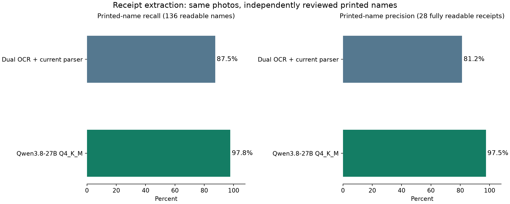

后续实测：[NInfer / NVFP4，同一 32 张原图](ninfer_evaluation.md)。

# Qwen3.8 Q4_K_M 收据测试报告

日期：2026-09-18。测试数据库当时全部 **32 张确认收据、32 张原图**。名称基线改为逐张查看照片后的**票面名称**，不使用商品名称或用户别名。

**结论：Qwen Q4_K_M 适合继续试作第三路名称复核。** 本轮名称命中率比双 OCR 高 10.3 个百分点，但仍会漏重量、错绑称重信息、重复扣优惠和误用支付金额。应保留现有双 OCR 与确定性的金额/重量校验；目前证据不足以让 Qwen 独立承担整张结构化结果。线上识别逻辑未切换。

## 主要结果

| 指标 | Unlimited-OCR + PP-OCR + 当前 parser | Qwen3.8-27B Q4_K_M |
| --- | ---: | ---: |
| 返回并通过后端结构校验 | 32/32 | 32/32 |
| 可辨认票面名称命中 | 119/136（87.5%） | 133/136（97.8%） |
| 名称精确率，仅全部可辨认的 28 张 | 104/128（81.2%） | 117/120（97.5%） |
| 整张所有名称正确、无多余商品 | 18/28 | 26/28 |
| 商品行数正确 | 28/32 | 31/32 |

相对现有双 OCR，Qwen 正确读出了其未命中的 **14** 个名称，也退步了 **0** 个名称。这是两套独立结果的比较，**尚未实现或测量三模型融合后的正确率**。

## 具体改善与剩余问题

### 名称改善

- **57bb2995，Costco**：正确读取 `KITCHENTWLE`；双 OCR 为 `KTTCBNTWLE`。`6PK BATH TWL` 两套都读对，数据库保存的“浴巾”不再作为名称评分答案。
- **834a4c6e，SkyFoods**：商品分组和十个商品行均完整；可辨认名称 8/8，正确读取 `LIUPO CHILI OIL`。两行遮挡/歧义名称不强行评分。
- **72a635b2，Feilong**：七个商品名称前的购买数量正确分离；双 OCR 将 `1 CABBAGE`、`2 SCALLION` 等数量并入名称。
- **e3843baa、ebf82f5b、1b072114、b69bb2c5**：消除了现有 parser 把 regular-price/savings、折扣标签、税或 NO TAX 当成额外商品的情况。Target 的商品 SKU 也与 `FAGE` 名称分开。

### 需要保留人工复核的错误

| 收据 | 票面或确认的正确内容 | Qwen 输出与影响 |
| --- | --- | --- |
| `c00860de` Costco | `YLW NECTARIN`；`CHICALFREDO` | 分别读成 `YLM NECTARIN`、`CHICALAFREDO`；仍有缩写补字/错字 |
| `8572dcef` Costco | `ORGNC BS THG`；消费总额 $138.03 | 名称为 `DRGNC BS THG`；将奖励抵付后的 $123.80 作为总额 |
| `fe3a7e41` Hualian | 六个商品；蓝莓英文续行属于上面同一项 | 生成七个商品；`OZBLU BLUEBERRIES BLUETS` 被另建为 $1.86 商品，这个金额实际来自下方卷心菜；三条称重信息均遗漏 |
| `78f63611` 99 Ranch | ENVY APPLE：2.65 lb @ $2.99/lb，$7.92 | 名称、金额正确，但重量和单价均为空，且没有标记称重 |
| `199fc34a` H Mart | 苹果 2.91 lb @ $2.99/lb；香蕉 3.11 lb @ $1.29/lb | 把香蕉的重量和单价给了苹果；香蕉重量为空。金额乘法可以抓出矛盾 |
| `d7f8ff6d` SkyFoods | 三个蔬菜行均印有称重信息 | 名称和金额正确，三个重量/单价均为空 |
| `1b072114` 99 Ranch | 打印的商品金额已含优惠，总额 $53.83 | 商品保留净价却仍独立减去 $4.00、$0.99、$0.99，并标为 gross；造成重复扣减 $5.98，且四条称重信息遗漏 |

Hualian 的 `FAGE GREEK STRAINED YOGURT 2% MILK FAT` 全部实际印在同一商品的两行上，**计为正确票面名称**。错的是额外生成蓝莓商品，不是保留真实续行。

若接入第三路，建议先对名称分歧和可疑商品行提供候选、来源和黄标；重量、单价、折扣关联和总额必须独立交叉核验。两个传统 OCR 也可能同时读错，不能单凭简单多数投票决定。需另测融合策略和排队延迟，尤其是同一 GPU 上模型切换的成本。

## 标准答案与评分方法

- [逐图核验标注](../tests/backend_api/corpus/annotations/2026-09-18-printed-names.json)由 Codex 查看全部原图形成，尚未经用户独立复核。照片、确认快照及数据库均未改写。
- 共 144 个商品/退款描述行，其中 8 行因笔迹、印章、O/0 或 B/R 等无法唯一确认的字符，排除出名称分母，剩余 136 行。含不确定行的 4 张收据不参与整张名称完全正确率与精确率。
- 只忽略大小写、空白和标点；保留字母、数字、票面缩写和拼写。不能把 `KITCHENTWLE` 改写成完整英文，也不能把 `6PK BATH TWL` 翻译为“浴巾”后判对。独立数量、SKU、税码和 WT 不属于商品名称。
- 按名称一对一匹配，重复购买行重复计数。漏行会降低命中率，多出的商品会降低精确率。税、折扣、押金、付款标签不纳入商品名称标准行。
- 名称允许照片上已核验、确属同一商品的英文续行，例如 Hualian 的 `FAGE GREEK STRAINED YOGURT 2% MILK FAT`；这不是臆造名称。**没有评测中文续行的逐字正确率**。
- 店名作为已知上下文传入，Logo 匹配不在本轮范围。模型没有得到名称、金额答案或其他 OCR 输出。
- 这些收据曾用于 parser 开发，属于本地回归集；不是独立新商店泛化测试。每张仅一幅图，不能据此推断多图长收据效果。

## 金额、时间、重量：辅助核验

下表与冻结的确认记录比较，**没有把确认记录里的名称作为文字标准答案**。未将全部历史字段重新做独立人工标注，因此这些是一致率。

| 指标 | 双 OCR | Qwen Q4_K_M |
| --- | ---: | ---: |
| 总金额一致 | 32/32 | 31/32 |
| 非零明细的金额及类型集合一致 | 26/32 | 25/32 |
| 已标记为识别所得的交易时间一致 | 25/29 | 25/29 |
| 已确认称重行的金额+重量组合命中 | 20/20 | 13/20 |

时间跳过“估计时间”和“用户输入时间”，只比较 `recognized`。重量只比较确认记录中明确为称重且有重量的 20 行；不能代表全部商品重量准确率。金额集合指标不证明商品与折扣的关联一定正确。

部分金额集合差异仅是确认记录保存净价，而 Qwen 使用原价加单独折扣，二者合计相同，例如 Feilong 的 LIME、部分 H Mart 优惠及 SkyFoods 花生。因此不能把 25/32 直接叫作金额准确率。时间的四处差异涉及旧票年份/日期，应结合原图复核，不能把历史保存时间自动当成绝对事实。

## 与历史 Qwen3-VL / NuExtract 比较

下表仅取共同的 **24 张相同原图**，逐一验证照片 SHA256，并用本次相同票面名称标注重新计分；共 93 个可辨认名称。历史失败请求仍占分母。

| 方案 | 票面名称命中 | 名称整张完全正确 | 商品行数正确 |
| --- | ---: | ---: | ---: |
| 双 OCR + 当前 parser | 82/93（88.2%） | 14/22 | 20/24 |
| Qwen3.8-27B Q4_K_M | 92/93（98.9%） | 21/22 | 24/24 |
| Qwen3-VL-8B BF16（历史） | 78/93（83.9%） | 16/22 | 17/24 |
| Qwen3-VL-32B AWQ（历史） | 59/93（63.4%） | 9/22 | 11/24 |
| NuExtract3（历史） | 38/93（40.9%） | 7/22 | 18/24 |
| NuExtract-2.0-8B（历史） | 0/93（0.0%） | 0/22 | 0/24 |

旧模型结果是历史归档重新评分，本轮没有重新调用旧模型。提示词、视觉分辨率预算、量化、推理框架和重试策略不同，因此这是这些具体方案的回归比较，不是控制所有变量后的模型能力排名。NuExtract-2.0 当时没有有效结果，0 分反映那次部署运行失败。不能拿此表的 24 张百分比直接替代上表 32 张结果。

## 运行配置与耗时

- 模型：[ggml-org/Qwen3.8-27B-GGUF](https://huggingface.co/ggml-org/Qwen3.8-27B-GGUF)，Q4_K_M；视觉投影器 BF16。固定 revision、权重与运行时校验值见[部署记录](../tests/backend_api/corpus/baselines/2026-09-18-qwen38-q4/deployment.json)。
- [llama.cpp b11037](https://github.com/ggml-org/llama.cpp/releases/tag/b11037)，CUDA 12.8，RTX 5090 32 GB；Docker 内本地运行，临时端口只绑定回环地址。
- 串行 1 个请求，关闭 thinking，32K 上下文，4096 图像 token 上限，8192 输出 token，temperature=0、seed=42；JSON Schema 约束输出，无重试。
- 先按 EXIF 调正原图方向，再编码 PNG；模型内部仍按图像 token 预算处理。通用提示词叠加商店规则，与现有接口 JSON 结构一致。
- 32 张整批 **887.8 秒（14.8 分钟）**；单张请求中位数 **24.6 秒**，范围 **8.0–49.6 秒**。批次包含图片准备，请求耗时包括本地传输和推理；均不含模型加载及初次端口排错。未单独预热，首个正式请求也计入。
- 推理中一次设备显存采样约 **25.1 GiB**，不是峰值。原双 OCR 也占用大量显存，同一张 32 GB GPU 无法直接让这套 Qwen 与现有两模型一起常驻。
- 双 OCR 对照复用同 SHA256 原图的实际 OCR 缓存：8 张近期识别记录与 24 张旧双模型输出，重新经过当前 parser。**没有重新推理双 OCR，故本报告不作速度对比。**

## 逐张名称结果

“命中”分母只含该张可辨认的票面名称；0/0 表示名称被遮挡不评分。行数列依次为双 OCR / Qwen / 原图。点击编号查看此次原图。

| 收据 | 店铺 | 双 OCR 名称命中 | Qwen 名称命中 | 商品行数 双/Qwen/原图 |
| --- | --- | ---: | ---: | ---: |
| [57bb2995](../tests/backend_api/corpus/baselines/2026-09-18-qwen38-q4/images/57bb2995-1993-4ff0-863e-43764ee31526-0.jpg) | Costco | 5/6 | 6/6 | 6/6/6 |
| [834a4c6e](../tests/backend_api/corpus/baselines/2026-09-18-qwen38-q4/images/834a4c6e-9307-40bb-acf6-c143c5f41e73-0.jpg) | skyFOODS | 7/8 | 8/8 | 10/10/10 |
| [560ccf19](../tests/backend_api/corpus/baselines/2026-09-18-qwen38-q4/images/560ccf19-b7af-4ad6-a512-1dd51853f4d8-0.jpg) | Costco | 7/7 | 7/7 | 7/7/7 |
| [74356ee7](../tests/backend_api/corpus/baselines/2026-09-18-qwen38-q4/images/74356ee7-d2e7-42e4-aea1-8fa567dec8ea-0.jpg) | skyFOODS | 4/4 | 4/4 | 4/4/4 |
| [78f63611](../tests/backend_api/corpus/baselines/2026-09-18-qwen38-q4/images/78f63611-ad9f-4982-86aa-7b16450f46a7-0.jpg) | 99 Ranch | 1/1 | 1/1 | 1/1/1 |
| [2f97fc50](../tests/backend_api/corpus/baselines/2026-09-18-qwen38-q4/images/2f97fc50-4cf3-47e1-bd44-ea6de95c774c-0.jpg) | 99 Ranch | 3/3 | 3/3 | 5/5/5 |
| [72a635b2](../tests/backend_api/corpus/baselines/2026-09-18-qwen38-q4/images/72a635b2-4b7e-4612-98ab-0f74d47fca59-0.jpg) | Feilong | 0/7 | 7/7 | 7/7/7 |
| [fe3a7e41](../tests/backend_api/corpus/baselines/2026-09-18-qwen38-q4/images/fe3a7e41-45ad-4865-8a83-427a696481db-0.jpg) | Hualian | 5/5 | 5/5 | 6/7/6 |
| [e3843baa](../tests/backend_api/corpus/baselines/2026-09-18-qwen38-q4/images/e3843baa-904a-4bbf-bc21-278a1693d5c7-0.jpg) | H MART | 4/4 | 4/4 | 8/4/4 |
| [199fc34a](../tests/backend_api/corpus/baselines/2026-09-18-qwen38-q4/images/199fc34a-4857-4aac-873c-8c55f8b223a9-0.jpg) | H MART | 5/5 | 5/5 | 5/5/5 |
| [4e491343](../tests/backend_api/corpus/baselines/2026-09-18-qwen38-q4/images/4e491343-7593-42b4-b5b5-01e5648557ee-0.jpg) | Costco | 4/4 | 4/4 | 4/4/4 |
| [c00860de](../tests/backend_api/corpus/baselines/2026-09-18-qwen38-q4/images/c00860de-60e8-4892-8bc3-1e0b2c8314ab-0.jpg) | Costco | 3/7 | 5/7 | 7/7/7 |
| [6d9da1ec](../tests/backend_api/corpus/baselines/2026-09-18-qwen38-q4/images/6d9da1ec-c0fc-4905-82b4-4ebd11716b1c-0.jpg) | skyFOODS | 7/7 | 7/7 | 7/7/7 |
| [e6c62f11](../tests/backend_api/corpus/baselines/2026-09-18-qwen38-q4/images/e6c62f11-3b8d-4ac0-a860-1756df0efa55-0.jpg) | Costco | 8/8 | 8/8 | 8/8/8 |
| [73953603](../tests/backend_api/corpus/baselines/2026-09-18-qwen38-q4/images/73953603-31f5-496a-9dd4-76fc845c8398-0.jpg) | skyFOODS | 4/4 | 4/4 | 4/4/4 |
| [d7f8ff6d](../tests/backend_api/corpus/baselines/2026-09-18-qwen38-q4/images/d7f8ff6d-6502-4eeb-8850-2f15b131988f-0.jpg) | skyFOODS | 3/3 | 3/3 | 3/3/3 |
| [a31f7e6b](../tests/backend_api/corpus/baselines/2026-09-18-qwen38-q4/images/a31f7e6b-8bb1-49c8-a292-504d76d1a59c-0.jpg) | skyFOODS | 4/4 | 4/4 | 4/4/4 |
| [8572dcef](../tests/backend_api/corpus/baselines/2026-09-18-qwen38-q4/images/8572dcef-7f7f-4d77-80c6-0ede75d45fa3-0.jpg) | Costco | 8/9 | 8/9 | 9/9/9 |
| [3a8e3c19](../tests/backend_api/corpus/baselines/2026-09-18-qwen38-q4/images/3a8e3c19-e8d0-4ea8-8fa3-06e3cd5fcfd4-0.jpg) | Costco | 5/5 | 5/5 | 5/5/5 |
| [e9ee06e0](../tests/backend_api/corpus/baselines/2026-09-18-qwen38-q4/images/e9ee06e0-f4aa-4c3c-812a-4e8abc21e3f0-0.jpg) | skyFOODS | 4/4 | 4/4 | 4/4/4 |
| [924e246e](../tests/backend_api/corpus/baselines/2026-09-18-qwen38-q4/images/924e246e-c811-497a-a61b-6b5724f7bacd-0.jpg) | Costco | 2/2 | 2/2 | 2/2/2 |
| [e297a3d3](../tests/backend_api/corpus/baselines/2026-09-18-qwen38-q4/images/e297a3d3-f9f1-4ba7-8e5e-a18e56fdecdd-0.jpg) | H MART | 1/1 | 1/1 | 1/1/1 |
| [a6618e05](../tests/backend_api/corpus/baselines/2026-09-18-qwen38-q4/images/a6618e05-1d59-453f-90e9-4bbf87a3830c-0.jpg) | H MART | 2/2 | 2/2 | 2/2/2 |
| [ebf82f5b](../tests/backend_api/corpus/baselines/2026-09-18-qwen38-q4/images/ebf82f5b-c4e7-4a49-8ce7-927233bfde95-0.jpg) | skyFOODS | 6/6 | 6/6 | 8/6/6 |
| [5331c892](../tests/backend_api/corpus/baselines/2026-09-18-qwen38-q4/images/5331c892-9fb6-42b5-bdb3-5a205b1a0767-0.jpg) | skyFOODS | 2/2 | 2/2 | 2/2/2 |
| [20267232](../tests/backend_api/corpus/baselines/2026-09-18-qwen38-q4/images/20267232-d4d0-4540-9c14-b0e051b06445-0.jpg) | Costco | 0/0 | 0/0 | 3/3/3 |
| [c5fdc978](../tests/backend_api/corpus/baselines/2026-09-18-qwen38-q4/images/c5fdc978-8f74-43bf-a5c5-e22d28f5aea9-0.jpg) | Costco | 1/1 | 1/1 | 1/1/1 |
| [ca76c352](../tests/backend_api/corpus/baselines/2026-09-18-qwen38-q4/images/ca76c352-9601-498c-8324-0ef9bcf5ea3b-0.jpg) | Costco | 2/3 | 3/3 | 3/3/3 |
| [4fc6a91b](../tests/backend_api/corpus/baselines/2026-09-18-qwen38-q4/images/4fc6a91b-faba-4d3e-82a3-be4c78270e99-0.jpg) | Costco | 1/1 | 1/1 | 1/1/1 |
| [6dd0be7d](../tests/backend_api/corpus/baselines/2026-09-18-qwen38-q4/images/6dd0be7d-4b6e-4b97-8a3d-c76de14f434c-0.jpg) | Costco | 2/3 | 3/3 | 3/3/3 |
| [1b072114](../tests/backend_api/corpus/baselines/2026-09-18-qwen38-q4/images/1b072114-24ee-4bb5-80a5-018ce442a512-0.jpg) | 99 Ranch | 9/9 | 9/9 | 10/9/9 |
| [b69bb2c5](../tests/backend_api/corpus/baselines/2026-09-18-qwen38-q4/images/b69bb2c5-7c75-4870-803e-25e321e086dd-0.jpg) | Target | 0/1 | 1/1 | 2/1/1 |

完整输出、逐项差异和规范化结果见[测试归档](../tests/backend_api/corpus/baselines/2026-09-18-qwen38-q4/summary.json)。名称评分可用 [printed_name_evaluation.py](../tests/backend_api/printed_name_evaluation.py) 重跑；契约测试覆盖重复行、名称与商品名称隔离、无法辨认字段和失败请求分母。

验证完成：6 项 Python 评测契约测试通过；22 项 Rust 语料测试通过；32 张候选经后端校验与规范化完成；相关 Rust 静态检查通过。临时推理容器已移除，原 backend_api、backend_ocr 均恢复健康。确认数据库与照片未修改。
